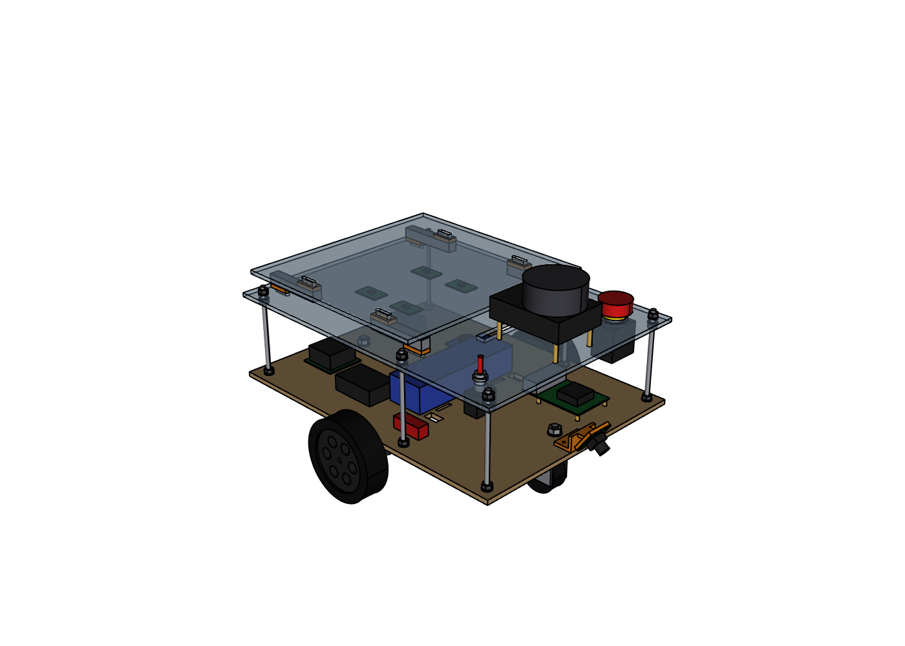
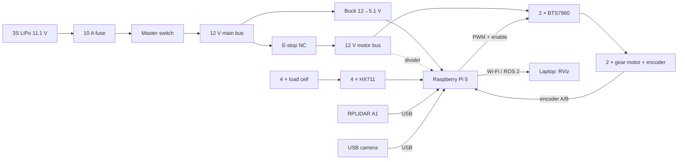
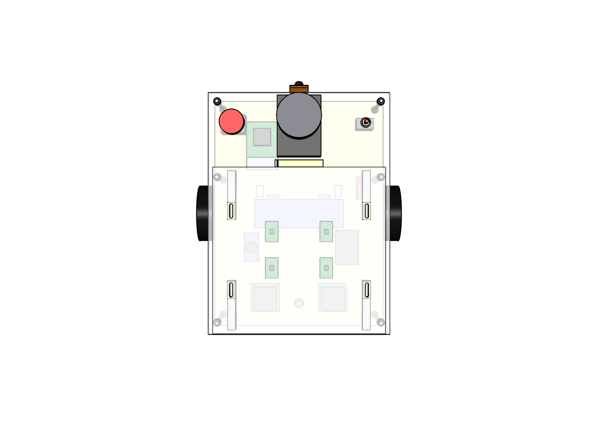
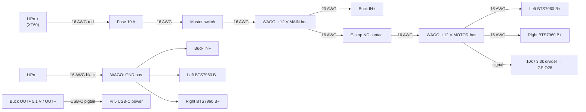
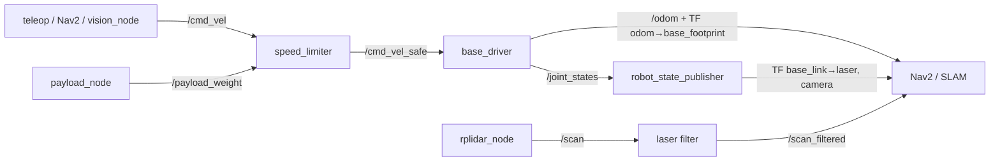

# Cargo Robot: Complete Build Guide (Phase II)

**From today, Monday 28 September 2026, to the final defense (week of 14 December 2026).**

This guide covers the whole build: parts, tools, fabrication, assembly, every wire, Raspberry Pi setup, all the code, calibration, mapping, autonomous navigation, testing and the final report. Follow it top to bottom.



---

## Contents

- [0. How to use this guide](#0-how-to-use-this-guide)
- [1. The robot on one page](#1-the-robot-on-one-page)
- [2. Timeline](#2-timeline)
- [3. Safety rules](#3-safety-rules-read-before-you-touch-anything)
- [Week 0: Decisions, shopping, laptop setup (28 Sep – 4 Oct)](#week-0--decisions-shopping-laptop-setup-28-sep--4-oct)
- [Week 1: Fabrication & mechanical assembly (5 – 11 Oct)](#week-1--fabrication--mechanical-assembly-5--11-oct)
- [Week 2: Power & safety wiring (12 – 18 Oct)](#week-2--power--safety-wiring-12--18-oct)
- [Week 3: Raspberry Pi setup, signal wiring, bench tests (19 – 25 Oct)](#week-3--raspberry-pi-setup-signal-wiring-bench-tests-19--25-oct)
- [Week 4: ROS 2 package, robot model, lidar, camera (26 Oct – 1 Nov)](#week-4--ros-2-package-robot-model-lidar-camera-26-oct--1-nov)
- [Week 5: Driving: motor control, PID, odometry (2 – 8 Nov)](#week-5--driving-motor-control-pid-odometry-2--8-nov)
- [Week 6: SLAM: mapping the test area (9 – 15 Nov)](#week-6--slam-mapping-the-test-area-9--15-nov)
- [Week 7: Payload logic & vision (16 – 22 Nov)](#week-7--payload-logic--vision-16--22-nov)
- [Week 8: Autonomous navigation & delivery missions (23 – 29 Nov)](#week-8--autonomous-navigation--delivery-missions-23--29-nov)
- [Week 9: Field testing & metrics (30 Nov – 6 Dec)](#week-9--field-testing--metrics-30-nov--6-dec)
- [Week 10: Cable harness, covers, auto-start (7 – 13 Dec)](#week-10--cable-harness-covers-auto-start-7--13-dec)
- [Week 11: Report, video, presentation, demo (14 – 20 Dec)](#week-11--report-video-presentation-demo-14--20-dec)
- [Troubleshooting](#troubleshooting)
- [Appendix A: Skills crash course](#appendix-a--skills-crash-course)
- [Appendix B: Full source code](#appendix-b--full-source-code)

---

## 0. How to use this guide

- **Each week has:** a goal, numbered steps with checkboxes `- [ ]`, and a **"Done when"** test. Don't start the next week until the "Done when" test passes (or you know exactly why it doesn't).
- **Where each command runs:**
  - **[PI]**: in a terminal on the Raspberry Pi (you'll reach it over SSH from your laptop).
  - **[LAPTOP]**: on your Ubuntu laptop.
  - **[WINDOWS]**: in PowerShell on a Windows laptop.
- **Commands:** type grey command boxes exactly as shown, one line at a time. Lines starting with `#` are comments; you don't type them.
- **You don't need to type any code.** All of it is already in the project folder (see [Appendix B](#appendix-b--full-source-code)); this guide explains it and shows how to run it.
- **New to a skill?** If a step needs something you've never done (SSH, soldering, crimping, using a multimeter, git), read [Appendix A](#appendix-a--skills-crash-course) first.

### The project folder

```
Gradfinal/                      <- this folder. Put it on GitHub; on the Pi it lives in ~/cargo_robot
├── BUILD_GUIDE.md              <- this guide
├── HW & Time plan.pdf          <- your Phase II plan
├── cad/                        <- 3D design (Python/CadQuery) -> STEP, STL, DXF files
│   ├── robot_cad.py            <- the design; change numbers at the top, re-run
│   ├── autocad/                <- CargoRobot_v2.dxf (AutoCAD: 3D model + 7 A3 drawing sheets) + the sheets as PDF
│   └── output/                 <- robot_assembly.step, parts/*.stl, dxf/*.dxf, views/*.png, bom.csv
├── robot_ws/src/cargo_bot/     <- the ROS 2 package that runs on the robot
│   ├── cargo_bot/              <- Python code: drivers, nodes, mission
│   ├── config/                 <- settings (robot.yaml, laser filter, Nav2, SLAM)
│   ├── launch/                 <- robot.launch.py, slam.launch.py, nav.launch.py
│   └── urdf/                   <- robot model for RViz / TF
└── tools/                      <- bench-test and setup scripts (run without ROS)
```

### Words you will meet

| Word | Meaning |
|---|---|
| **ROS 2 (Jazzy)** | The robot software framework. Programs ("nodes") talk to each other by publishing messages on named "topics". |
| **Node** | One running program, e.g. `base_driver`. |
| **Topic** | A named channel, e.g. `/cmd_vel` (speed commands), `/scan` (lidar), `/odom` (wheel odometry). |
| **Launch file** | Starts many nodes at once with their settings. |
| **TF** | The tree of coordinate frames (`map → odom → base_footprint → base_link → laser`). |
| **Odometry** | Where the robot thinks it is, from counting wheel rotations. It drifts over time. |
| **SLAM** | Building a map with the lidar while driving around. |
| **AMCL** | Finding where the robot is on a saved map. |
| **Nav2** | The navigation system: plans a path and drives it while avoiding obstacles. |
| **Costmap** | Nav2's grid of "how dangerous is each cell". |
| **GPIO** | The Pi's 40-pin header; each pin can be a 3.3 V digital input or output. |
| **PWM** | Switching a pin on and off very fast; the on-percentage ("duty") sets motor power. |
| **Encoder** | A sensor on the motor that sends pulses as it turns. It gives the wheel speed and distance. |
| **HX711** | A tiny amplifier + 24-bit ADC that reads one load cell. |
| **SSH** | Logging into the Pi's terminal from your laptop over Wi-Fi. |

---

## 1. The robot on one page

| | |
|---|---|
| Size | 434 × 360 × 263 mm (L × W × H) |
| Frame | 6 mm plywood bottom plate + 5 mm acrylic deck, held apart by 6 M6 threaded rods. A 5 mm acrylic cargo plate sits on 4 load cells. |
| Drive | 2 × 12 V gear motors with encoders (middle axle), plus 50 mm swivel casters front and rear. Differential drive, so it turns on the spot. |
| Brain | Raspberry Pi 5 (8 GB) running Ubuntu 24.04 + ROS 2 Jazzy. **No ESP32**: the Pi drives the motors, reads the encoders and reads the load cells directly. |
| Sensors | RPLIDAR A1M8 (360° 2D lidar), USB wide-angle camera (line following + station markers), 4 × 10 kg load cells under the cargo bed |
| Power | 3S LiPo 11.1 V 5000 mAh → 10 A fuse → master switch. The 12 V goes to the motors through the E-stop; a 5 V buck converter powers the Pi. |
| Safety | Latching E-stop cuts **motor power only** (the Pi stays on and sees it on GPIO26). Software also stops the motors if commands stop arriving or the cargo is overloaded. |
| Max payload | 15 kg (software limit, adjustable). Speed drops smoothly to 50 % at full load. |
| Autonomous speed | 0.35 m/s |



### What changed compared to the Phase II PDF (tell your supervisor)

| PDF | This guide | Why |
|---|---|---|
| Raspberry Pi **+ ESP32** | **Raspberry Pi only** | Fewer parts, no firmware to write, no serial bridge. The Pi handles encoders and HX711s fine at this robot's speeds. Tasks 1.3 and 2.1.1 become "Pi driver code" (already written). |
| E-stop cuts the whole 12 V line | E-stop cuts **only the motor 12 V** | Cutting the Pi's power corrupts its SD card and forces a 1-minute reboot. The motors still stop instantly, and the software sees the E-stop. |
| 2020 aluminium or acrylic/MDF frame | Plywood + acrylic plates on **6 M6 threaded rods** | Cheapest and simplest: the rod is cut with a hacksaw, and the deck height is set with nuts. No aluminium profiles and no printing. |
| Heavy-duty omni-wheel casters | **50 mm swivel casters with an M8 threaded stem** | Bolt straight on. The caster height is adjusted with a nut, so all 4 wheels can be made to touch the floor. Omni wheels would need a custom mount and shims. |
| Pi Camera V2/V3 **or** USB camera | **USB camera** | Works out of the box on Ubuntu 24.04 + ROS 2. The Pi camera on a Pi 5 under Ubuntu needs a custom-built camera library. |
| 12 V 300–500 RPM motors | **12 V 170 RPM** (same JGB37-520 size) | 300–500 RPM with 100 mm wheels means 1.6–2.6 m/s top speed and little torque. 170 RPM gives about 0.9 m/s and roughly 3× the torque for carrying cargo. |

---

## 2. Timeline

| Week | Dates (2026) | Goal | Done when |
|---|---|---|---|
| 0 | 28 Sep – 4 Oct | Approvals, **order everything**, laptop + GitHub ready | Parts ordered, DXF files at the laser shop, laptop runs ROS 2 |
| 1 | 5 – 11 Oct | Cut, print and assemble the mechanics | Rolling chassis with all 4 wheels on the floor |
| 2 | 12 – 18 Oct | Power & safety wiring + bench tests | 12 V / 5 V rails measured, E-stop kills motor power, Pi boots from the battery |
| 3 | 19 – 25 Oct | Pi OS + ROS 2, signal wiring, motor/encoder/load-cell tests | `test_motors`, `test_encoders`, `test_hx711` all pass |
| 4 | 26 Oct – 1 Nov | ROS 2 package, robot model, lidar, camera | Laser scan + robot model visible in RViz on the laptop |
| 5 | 2 – 8 Nov | Driving: teleop, PID, odometry calibration | Robot drives a 1 m square and ends within 5 cm |
| 6 | 9 – 15 Nov | SLAM map of the test area | Clean map saved (`lab.yaml` + `lab.pgm`) |
| 7 | 16 – 22 Nov | Payload topic, speed scaling, line following, markers | Robot follows a tape line and slows down when loaded |
| 8 | 23 – 29 Nov | Nav2 + delivery mission | Full pickup → drop-off → home mission works 3 times in a row |
| 9 | 30 Nov – 6 Dec | Field tests & measurements | All test tables filled in |
| 10 | 7 – 13 Dec | Cable harness, covers, auto-start | Clean, labelled wiring; robot starts by itself at power-on |
| 11 | 14 – 20 Dec | Report, video, slides, demo rehearsal | Report submitted, video recorded, 2 full rehearsals done |

> **Parts can be late.** If they are, do Week 3's Pi setup (sections 3.1–3.4) and Week 4's software build early. Those only need the Pi and a phone charger.

**Suggested split for a team of 3–4:**

- **Mechanical lead:** weeks 1 and 10.
- **Electrical lead:** weeks 2 and 3 (wiring).
- **Software lead:** weeks 3–8.
- **Everyone:** weeks 9 and 11. One person owns the report from week 5 onwards and writes each week's section as it happens.

---

## 3. Safety rules (read before you touch anything)

1. **LiPo batteries can catch fire.**
   - Charge only with a LiPo balance charger, in a LiPo bag, never unattended, never on a bed or carpet.
   - Never let a cell drop below 3.3 V (the voltage alarm beeps at 3.5 V: stop and charge).
   - A puffy (swollen) battery is dead: stop using it.
   - Store it at 3.8 V per cell (the charger's "storage" mode).
2. **Wheels in the air.** When testing motors, put the robot on a box so the drive wheels spin freely.
3. **Know where the E-stop is.** It stays within reach every time the robot moves by itself, and one person always watches the robot.
4. **Never put more than 3.3 V on a Pi GPIO pin.** 5 V on a GPIO pin kills the Pi. That's why the encoders, HX711s and BTS7960 logic are all powered from **3.3 V**, and why the 12 V sense line goes through a divider.
5. **Wiring changes only with the master switch OFF** and the battery unplugged.
6. **Shut the Pi down before switching off the master switch:** run `sudo shutdown now` and wait for the green LED to stop blinking.
7. **Fuse first:** the fuse must be the first thing after the battery's + wire.

---

## Week 0 — Decisions, shopping, laptop setup (28 Sep – 4 Oct)

**Goal:** by Sunday everything is ordered, the plates are at the laser shop, and your laptop runs ROS 2.

### 0.1 Get approval from your supervisor (Monday)

Show the drawings, either as `cad/autocad/CargoRobot_v2_drawings.pdf` or the same file opened in AutoCAD. Also show the table "What changed compared to the Phase II PDF" in section 1. Then ask:

- [ ] Is it OK to drop the ESP32 and run everything on the Raspberry Pi?
- [ ] Is it OK that the E-stop cuts motor power only (not the Pi)?
- [ ] Is it OK to use a USB camera instead of the Pi Camera?
- [ ] Is it OK to use 170 RPM motors instead of 300–500 RPM?
- [ ] Is it OK to use swivel casters with threaded stems instead of omni-wheel casters?
- [ ] Can the SD card and cooling fan stay? (The PDF asked this.) Answer: **both are needed**. The Pi can't boot without a storage card, and a Pi 5 running SLAM + Nav2 overheats and slows down without its fan.
- [ ] Is an ML model required for "vision classification"? The simple, reliable plan here uses printed ArUco markers to identify stations; an optional ONNX model is described in week 7.
- [ ] What is the maximum payload you must demonstrate? (The software limit is 15 kg; change it in `config/robot.yaml`.)
- [ ] Where is the test area, and can you put tape lines and markers on its floor?

### 0.2 Shopping list

Buy locally what you can; online orders from abroad can take 2–4 weeks. **Order the lidar and motors first.** Quantities include a few spares where parts are cheap and easy to break.

**Electronics**

| # | Item | Qty | What to check when buying |
|---|---|---|---|
| E1 | Raspberry Pi 5, 8 GB (a Pi 4 8 GB also works) | 1 | |
| E2 | Official Raspberry Pi 5 Active Cooler | 1 | Pi 4: any fan + heatsink case |
| E3 | microSD card 64 GB, A2 class (SanDisk Extreme / Samsung EVO Plus) | 2 | Second card is for backups |
| E4 | JGB37-520 12 V gear motor **170 RPM** with Hall encoder (6 wires) | 2 | Shaft 6 mm D-shaped. The 6-wire cable usually has 2 motor wires + VCC, GND, A, B. Ask the seller for the gear ratio and encoder pulses per revolution (usually 11 PPR). |
| E5 | Wheel 100 mm diameter, ~30 mm wide, for 6 mm D-shaft (with hub/coupling + set screw) | 2 | Rubber tyre |
| E6 | Swivel caster, **50 mm** wheel, **M8 threaded stem** (≥ 25 mm long), ≥ 20 kg rating, rubber/PU wheel | 2 | Height from the floor to the top of its swivel body **60–70 mm** (the nuts make up the rest of the 72 mm). Get 4 M8 nuts + washers if none come with them. |
| E7 | BTS7960 43 A motor driver module ("IBT-2") | 2 | |
| E8 | RPLIDAR A1M8 (with its USB adapter board + cable) | 1 | The kit includes the USB adapter |
| E9 | USB camera module, UVC, 32 × 32 mm board, wide-angle (≥ 100°) M12 lens, 640×480 @ 30 fps | 1 | "UVC" means no driver needed. Get a USB cable ≥ 50 cm. |
| E10 | Straight-bar load cell, **10 kg**, 80 × 12.7 × 12.7 mm, 4 wires | 4 | Note the thread size of the end holes (M4 or M5) |
| E11 | HX711 load-cell amplifier module | 5 | 1 spare |
| E12 | 3S LiPo 11.1 V 5000 mAh, ≥ 20 C, XT60 plug | 1 (2 is better) | A second battery saves your demo day |
| E13 | LiPo balance charger (IMAX B6 / ISDT / SkyRC class) + power supply | 1 | |
| E14 | LiPo fire-safe bag | 1 | |
| E15 | LiPo voltage alarm (1–8 S buzzer, plugs into the balance lead) | 1 | |
| E16 | XL4015 5 A buck converter module (with current-limit pot) | 2 | 1 spare |
| E17 | USB-C male cable with bare wire ends ("USB-C pigtail"), 20 AWG | 1 | Or cut a good USB-C cable |
| E18 | Inline blade-fuse holder (14 AWG) + 10 A blade fuses | 1 + 5 | |
| E19 | Master switch: panel toggle switch, **12 V DC ≥ 15 A**, 12 mm mounting hole | 1 | The DC rating matters, not the AC rating |
| E20 | Emergency-stop mushroom button, **22 mm panel-mount**, latching, with an **NC contact block** (10 A) | 1 | "NC" = normally closed: power flows until pressed. No enclosure box needed: it mounts through the deck. |
| E21 | XT60 connector pairs | 4 | |
| E22 | WAGO 221 lever connectors: 221-415 (5-way) × 6, 221-413 (3-way) × 6 | 12 | Makes power buses without soldering |
| E23 | Raspberry Pi GPIO screw-terminal breakout HAT (40-pin) | 1 | Wires screw in instead of loose jumpers |
| E24 | Resistors 10 kΩ and 3.3 kΩ (¼ W) | 5 each | E-stop sense divider |
| E25 | Small perfboard (5 × 7 cm) | 2 | |
| E26 | Silicone wire 16 AWG red + black | 2 m each | Battery, fuse, switch, E-stop, drivers |
| E27 | Silicone wire 20 AWG red + black | 2 m each | Buck converter, motors |
| E28 | Jumper wires female-female and male-female, 20 cm | 40 each | Signals |
| E29 | 4-core cable (or 4 jumper wires) 50 cm | 4 | Load cells → HX711s → Pi |
| E30 | Ferrule kit + ferrule crimper | 1 | For every wire going into a screw terminal |
| E31 | Heat-shrink assortment, zip ties, spiral wrap, 20 mm velcro strap (1 m), double-sided foam tape | 1 | |
| E32 | Brass standoff kit M2.5 (for the Pi and the lidar) | 1 | |
| E33 | VHB (strong double-sided foam) tape, 19 mm | 1 roll | Holds the small boards (drivers, buck, HX711s) without drilling |

**Mechanical**

| # | Item | Qty | Notes |
|---|---|---|---|
| M1 | Laser cutting: `bottom_plate.dxf` in **6 mm plywood** (or 5 mm aluminium, CNC/waterjet) | 1 | Carries all the weight. **Not acrylic** (it cracks). |
| M2 | Laser cutting: `top_deck.dxf` in 5 mm acrylic (or 6 mm plywood) | 1 | |
| M3 | Laser cutting: `cargo_plate.dxf` in 5 mm acrylic | 1 | |
| M4 | 3D prints: `camera_mount.stl` × 1 and `load_cell_spacer.stl` × 8, in PETG (about 50 g, 3 hours) | 1 set | Any printer: a friend's, the university lab, or a print shop |
| M5 | **M6 threaded rod**, 1 m (zinc-plated steel) | 1 | Cut into 6 pieces of 130 mm |
| M6 | M6 nuts + M6 washers | 26 each | 24 needed (4 per rod) |
| M7 | Steel mounting bracket for 37 mm gear motors (often sold with the motor, including its M3 screws) | 2 | |
| M8 | M4 × 12 screws + M4 nylock nuts + washers | 6 each | Motor brackets → bottom plate (4 needed) |
| M9 | Screws for the load cells: M4 × 16 or M5 × 16 (match the cells' threads) + washers | 16 each | 2 per cell end |
| M10 | M3 × 12 screws + nuts | 4 | Camera mount |
| M11 | Blue thread-locker | 1 | Wheel set screws |
| M12 | Anti-slip rubber mat, ~27 × 28 cm | 1 | Stops cargo sliding on the acrylic |
| M13 | Black matte tape 19 mm or 50 mm (line) + white/light floor, masking tape | 1 roll each | Line following + marking stations |

**Tools you need:**

- Soldering iron, solder
- Multimeter (with a 10 A range)
- Wire stripper, side cutters, ferrule crimper
- Hacksaw and a file (to cut the threaded rod)
- Drill with bits 2.7 and 4.5 mm (the only holes you drill yourself: motor brackets in plywood, lidar screws in acrylic)
- Spanners 10 mm (M6 nuts) and 13 mm (M8 caster nuts), hex keys, screwdrivers
- Heat gun or lighter, marker, tape measure, square ruler
- A known reference weight for calibration: 2 kg of rice or sugar weighed on a kitchen scale is fine

### 0.3 Send the plates to the laser shop (Monday/Tuesday)

1. Files: `cad/output/dxf/bottom_plate.dxf`, `top_deck.dxf`, `cargo_plate.dxf`.
2. Tell the shop:
   - "Units are millimetres, cut every line, 1 piece each."
   - Material and thickness per the table above.
   - "Keep the protective film on the acrylic."
3. When you collect them, check:
   - **Bottom plate** (400 × 300 mm, plywood):
     - holes: 6 × 6.5 mm (rods), 2 × 8.5 mm (casters), 4 × 2.7 mm (Pi), 2 × 3.4 mm (camera)
     - slots: 4 small battery-strap slots and 2 cable slots
   - **Top deck** (400 × 300 mm, acrylic):
     - holes: 6 × 6.5 mm (rods), 22.5 mm (E-stop), 12.2 mm (switch)
     - slots: a long wiring slot, and 4 round-ended load-cell slots
   - **Cargo plate** (270 × 280 mm, acrylic): 4 round-ended load-cell slots.

### 0.4 Get the two small prints made

`camera_mount.stl` and 8 × `load_cell_spacer.stl`: about 3 hours of printing in total (settings in [section 1.2](#12-3d-printing)). Anyone with a printer can do it.

### 0.5 Set up your laptop

You need a laptop running **Ubuntu 24.04**. It runs RViz, the visual tool that shows the map, laser scan and robot, and lets you click navigation goals. ROS 2 Jazzy only supports Ubuntu 24.04.

**Option A (recommended): dual-boot Ubuntu 24.04 next to Windows**

1. [WINDOWS] Back up your files.
2. If BitLocker is on: Control Panel → BitLocker → **Suspend protection**.
3. Download "Ubuntu 24.04 LTS Desktop" from ubuntu.com. Write it to an 8 GB+ USB stick with **Rufus** or **balenaEtcher**.
4. Make room for Ubuntu: Windows Disk Management → right-click C: → **Shrink Volume** → shrink by at least 60 GB.
5. Reboot and open the boot menu (usually F12, F9 or Esc) → boot from the USB stick.
6. Choose **Install Ubuntu** → **Install alongside Windows**. Afterwards the computer asks which OS to start each time it boots.

**Option B: no Ubuntu laptop.** You can do everything over SSH from Windows PowerShell and view data with **Foxglove** (a desktop app for Windows) connected to `foxglove_bridge` on the Pi (installed in week 3). Clicking navigation goals is less convenient than in RViz, so use option A if you can.

**Install ROS 2 Jazzy desktop [LAPTOP]:**

```bash
sudo apt update && sudo apt install -y software-properties-common curl git
sudo add-apt-repository -y universe
export ROS_APT_SOURCE_VERSION=$(curl -s https://api.github.com/repos/ros-infrastructure/ros-apt-source/releases/latest | grep -F "tag_name" | awk -F\" '{print $4}')
curl -L -o /tmp/ros2-apt-source.deb "https://github.com/ros-infrastructure/ros-apt-source/releases/download/${ROS_APT_SOURCE_VERSION}/ros2-apt-source_${ROS_APT_SOURCE_VERSION}.$(. /etc/os-release && echo ${UBUNTU_CODENAME:-${VERSION_CODENAME}})_all.deb"
sudo dpkg -i /tmp/ros2-apt-source.deb
sudo apt update && sudo apt upgrade -y
sudo apt install -y ros-jazzy-desktop ros-dev-tools ros-jazzy-navigation2 ros-jazzy-nav2-bringup \
     ros-jazzy-teleop-twist-keyboard ros-jazzy-rqt-image-view
echo "source /opt/ros/jazzy/setup.bash" >> ~/.bashrc
echo "export ROS_DOMAIN_ID=42" >> ~/.bashrc
source ~/.bashrc
```

> If any of these commands fails, open **docs.ros.org → Jazzy → Installation → Ubuntu (deb packages)**. It has the current official version of the same steps.

Test it:

```bash
rviz2          # a window with a grid should open; close it
```

Also install **VS Code** from code.visualstudio.com with the **Remote - SSH** extension. It lets you edit files that live on the Pi as if they were on your laptop.

### 0.6 Put the project on GitHub

1. Create a free GitHub account for each team member. One person creates a **private** repository called `cargo_robot` and adds the others as collaborators.
2. [WINDOWS] Install **GitHub Desktop**. File → Add local repository → choose `C:\University\Gradfinal` → it offers to "create a repository here" → yes.
3. Create a file called `.gitignore` in that folder (this project already includes one) so the big CAD Python environment isn't uploaded:

   ```
   cad/.venv/
   robot_ws/build/
   robot_ws/install/
   robot_ws/log/
   __pycache__/
   ```

4. GitHub Desktop → **Commit to main** → **Publish repository** (keep "private" ticked).
5. From now on, every change is committed with a short message ("tuned PID", "added station 3"). This gives you a history for the report, and a way back when something breaks.

**Done when:**

- [ ] Supervisor approved the changes.
- [ ] Parts ordered, with an expected delivery date written down.
- [ ] Plates at the laser shop, printing started.
- [ ] `rviz2` opens on the laptop.
- [ ] The repository is on GitHub.

---

## Week 1 — Fabrication & mechanical assembly (5 – 11 Oct)

**Goal:** a rolling chassis: plates, rods, motors, wheels, casters, load cells, cargo plate, lidar, E-stop and switch mounted. There's no wiring yet.

Keep `cad/output/views/render_top.png` and `render_side.png` open while you work. They show where everything goes. All positions below are in millimetres, measured from the **centre** of the plate: +X is forward (lidar end), +Y is left. Almost every hole is already cut in the plates, so the positions are mostly for checking.



### 1.1 Laser-cut parts

Collect the three plates (section 0.3). Peel the film only from the side you'll write on. Mark the top face and the **FRONT** edge on each plate with a marker:

- **Bottom plate:** the 4 small Pi holes are at the front-left.
- **Top deck:** the big 22.5 mm E-stop hole is at the front-left.
- **Cargo plate:** it's symmetric, so any way round works.

### 1.2 3D printing

PETG, 0.2 mm layers, 245 °C nozzle / 80 °C bed, 4 walls:

| Part (file in `cad/output/parts/`) | Qty | Orientation | Infill | Supports |
|---|---|---|---|---|
| `camera_mount.stl` | 1 | Foot flat on the bed | 40 % | "Supports on build plate only" |
| `load_cell_spacer.stl` | 8 | Flat | 100 % | None |

### 1.3 Cut the threaded rods

1. Cut **6 pieces of 130 mm** from the M6 rod with a hacksaw.
2. **Trick:** before cutting, screw a nut past the cut mark. After cutting, unscrew it over the cut end. It re-forms the damaged thread.
3. File each cut end flat and lightly chamfered.

### 1.4 Assembly, step by step

Use nylock nuts where listed, and don't over-tighten anything that touches acrylic: firm with a small spanner is enough.

**Step 1: Motors into their steel brackets**

- [ ] Fix each motor to its bracket with the M3 screws that came with the bracket. The shaft sticks out of the bracket's outer face.

**Step 2: Brackets under the bottom plate** (the only holes you drill in plywood)

1. Turn the bottom plate upside down. Place a bracket so its flat base lies on the plate:
   - the vertical face (with the shaft) is **5 mm in from the side edge**;
   - the bracket is centred at X = 0 (the middle of the plate's length);
   - the motor body lies along the plate, pointing inwards.
2. Mark the bracket's base holes, drill **4.5 mm**, and fix with M4 × 12 + washer + nylock nut. Do the other side as a mirror image.
3. Route each motor's 6-wire cable up through the nearest cable slot (the 20 × 12 mm slots at X = +40, Y = ±70).

**Step 3: Drive wheels**

- [ ] Put a drop of blue thread-locker on the set screw.
- [ ] Slide the wheel hub onto the 6 mm D-shaft, ~2 mm clear of the bracket, and tighten the set screw **on the flat of the D**.

**Step 4: Rods on the bottom plate**

For each rod:

1. Screw an M6 nut on ~7 mm from one end and add a washer. This is the bottom end.
2. Push the rod **up** through a 6.5 mm hole from below. Add a washer + nut on top and tighten the two nuts against the plate.
3. Screw a third nut down the rod and put a washer on it. Set it so the top of the washer is **exactly 100 mm above the plate's top surface**. Cut a 100 mm piece of wood or card as a gauge and use it on all 6 rods. The deck will rest on these 6 washers.

Rod positions (the holes are pre-cut): X = −180, +60, +185 at Y = ±135.

**Step 5: Casters**

1. On each caster's M8 stem, screw one nut all the way down to the caster body and add a washer.
2. Push the stem up through the 8.5 mm hole (X = +160 front, X = −160 rear).
3. Add a washer + nut on top and tighten with a 13 mm spanner.

The final height is set in section 1.5.

**Step 6: Load cells on the deck** (before the deck goes on the rods)

The deck has 4 round-ended slots for the cells' **fixed ends**:

- **Rear cells:** the slots near the rear edge. Each cell runs forward from there.
- **Front cells:** the slots at X ≈ +57. Each cell runs **backwards** from there.

All 4 cells sit at Y = ±110, parallel to the robot's length. Their fixed ends face outward (rear cells to the rear edge, front cells to the front); their loaded ends point towards the middle of the cargo bed.

1. Each cell has an arrow on its side. Mount it so the arrow points **down**, the direction the load pushes.
2. Put a printed spacer on the deck over the slot, and the cell's fixed end on top.
3. Push 2 screws + washers up **from below**, through the slot and spacer, into the cell's threads. The slot fits hole spacings from ~5 to 23 mm from the cell's end, so any common bar cell fits.
4. Line the cell up parallel to the deck edge, then tighten.
5. The screws must **not** come out of the top of the cell. If they do, the cell can't flex. Use shorter screws or add a washer.

> The middle of each cell (the part with the white glue/gauges) must be free: it must not touch the deck or the cargo plate.

**Step 7: E-stop and master switch** (still before the deck goes on)

1. **E-stop:**
   1. Unclip the contact block and unscrew the big ring nut from the button.
   2. Push the button through the **22.5 mm hole** (front-left) from **above**.
   3. Screw the ring nut on from below, then clip the contact block back on underneath.
   4. Attach 2 × 40 cm of 16 AWG wire to its **NC** terminals now (it's easier than later). Week 2 connects them.
2. **Switch:**
   1. Remove the switch's nut.
   2. Push the switch up through the **12.2 mm hole** (front-right) from **below**.
   3. Add the washer + nut on top.
   4. Attach 2 × 40 cm of 16 AWG wire.

**Step 8: Lidar** (the only holes you drill in acrylic: 4 small ones)

1. Place the RPLIDAR on the front of the deck: centre at X = +140, Y = 0, with its cable/USB-board end pointing **backwards**.
2. Mark its 4 bottom mounting holes. Drill **2.7 mm**, slowly, with the protective film still on and the deck supported on scrap wood.
3. Mount it on M2.5 standoffs (~20–25 mm) so the cables can pass underneath.
4. Stick its small USB adapter board next to it with VHB tape.

**Step 9: Put the deck on**

1. Lower the deck onto the 6 rods (rods through the 6.5 mm holes). It rests on the 6 washers at 100 mm.
2. Add a washer + nut on top of each rod and tighten.
3. Put a spirit level (or a phone level app) on the deck to check it's level. Adjust the nuts if needed.

**Step 10: Cargo plate**

1. Put a printed spacer on each cell's **loaded end** (the end pointing to the middle).
2. Lay the cargo plate on so its 4 slots sit over the spacers. Push 2 screws + washers **down** through each slot and spacer into the cell.
3. Tighten gently.
4. The cargo plate must touch **only** the 4 spacers. Check with paper all around: no rubbing anywhere.
5. Stick the anti-slip rubber mat on top.

**Step 11: Camera**

1. Screw the USB camera board to the tilted face of `camera_mount` (drill 2 mm holes in the print to match the board). Point the lens down-forward.
2. Fix the mount's foot at the front edge of the bottom plate, using the two pre-cut 3.4 mm holes: M3 × 12 + nut.

### 1.5 Set the casters: all 4 wheels on the floor

The two drive wheels must carry most of the weight (for grip), and the casters must just touch the floor.

1. Put the robot on a flat floor. Slide a sheet of paper under each **caster**.
2. **Paper slides out freely** (the caster is too high):
   1. Loosen the top nut.
   2. Screw the lower nut **up** the stem (towards the plate) by half a turn; add a washer if needed.
   3. Retighten the top nut.
3. **A drive wheel lifts off** (the caster is too low): do the opposite, moving the lower nut down towards the caster body.
4. **Target:** each caster grips its paper, but a firm tug still pulls it out. Both drive wheels grip their paper hard.
5. **Stem too short to adjust?** Measure the plate's underside height above the floor next to the caster hole (H), and the caster's height from the floor to the top of its swivel body (C). The gap between caster body and plate must be **H − C**: use nuts and washers to make that gap.

### 1.6 Mechanical checks

- [ ] Push the robot by hand: it rolls straight, turns smoothly, the casters swivel freely, nothing rubs.
- [ ] Put 10 kg on the cargo plate: nothing bends visibly, the cargo plate touches only the spacers, and no wheel lifts.
- [ ] Press the E-stop hard: the deck doesn't bend noticeably. If it does, add a nut/washer "support" under the deck near the E-stop.

**Done when:** the chassis rolls freely with all 4 wheels on the floor and carries 10 kg. Take photos for the report.

---

## Week 2 — Power & safety wiring (12 – 18 Oct)

**Goal:** battery → fuse → switch → 12 V bus → (E-stop → motor drivers) and (buck → 5.1 V → Pi). Everything is measured and safe.

> Work with the battery **unplugged**. Plug it in only for the measurements, with the master switch OFF first.

### 2.1 Power diagram



### 2.2 Power wire list

| # | From | To | Wire | End fittings |
|---|---|---|---|---|
| P1 | Battery XT60 (use a male XT60 lead) + | Fuse holder (in) | 16 AWG red, 10 cm | XT60 soldered; fuse holder crimped/soldered |
| P2 | Fuse holder (out) | Master switch terminal 1 | 16 AWG red | Crimp/solder to switch |
| P3 | Master switch terminal 2 | WAGO **MAIN +12 V** (5-way) | 16 AWG red | Ferrule-free (WAGO takes bare wire) |
| P4 | Battery XT60 − | WAGO **GND** (5-way; add a second one linked to it if you need more slots) | 16 AWG black | |
| P5 | MAIN +12 V | E-stop NC terminal 1 (contact block under the deck) | 16 AWG red, ~40 cm | Ferrule into the contact block's screw terminal |
| P6 | E-stop NC terminal 2 | WAGO **MOTOR +12 V** (5-way) | 16 AWG red, ~40 cm | Ferrule |
| P7 | MOTOR +12 V | Left BTS7960 **B+** | 16 AWG red | Ferrule |
| P8 | MOTOR +12 V | Right BTS7960 **B+** | 16 AWG red | Ferrule |
| P9 | GND | Left BTS7960 **B−** | 16 AWG black | Ferrule |
| P10 | GND | Right BTS7960 **B−** | 16 AWG black | Ferrule |
| P11 | Left BTS7960 **M+ / M−** | Left motor: red (M1) / white (M2) | 20 AWG (or the motor's own wires) | Ferrules |
| P12 | Right BTS7960 **M+ / M−** | Right motor: red (M1) / white (M2) | 20 AWG | Ferrules |
| P13 | MAIN +12 V | Buck **IN+** | 20 AWG red | Ferrule |
| P14 | GND | Buck **IN−** | 20 AWG black | Ferrule |
| P15 | Buck **OUT+ / OUT−** | USB-C pigtail red / black | the pigtail's wires, max 30 cm | Ferrules |
| P16 | LiPo balance plug | Voltage alarm | — | Plug in, check the alarm shows 3 cell voltages |

> **Motor wire colours:** the most common JGB37-520 encoder cable is red = motor +, white = motor −, blue = encoder VCC, black = encoder GND, yellow = encoder A, green = encoder B. **Check your seller's diagram.** Only red and white go to the driver in this week; the other four are for week 3.

### 2.3 Building it, in order

1. **Battery lead.** Solder a male XT60 onto 10 cm of 16 AWG red + black.
   - Heat-shrink each joint.
   - The XT60 housing has small **+** and **−** marks moulded next to the pins. Red goes to +. When the lead is finished, and before connecting anything else to it, plug it into the battery. With the multimeter's red probe on the red wire and black probe on the black wire, it must read **+11 to +12.6 V** (not a negative number).
2. **Fuse.** Crimp or solder the inline fuse holder into the red wire, as close to the XT60 as possible. Leave the fuse **out** for now.
3. **Switch.** The switch is mounted in the deck (week 1, step 7), with its two 40 cm wires hanging down into the bay. Connect them as P2 and P3. Put the WAGO buses on the bottom plate near the power-distribution corner (rear-right), fixed with VHB tape.
   - Leave the wires going up to the deck (switch, E-stop, lidar USB, load cells) with **~10 cm of slack**, so the deck can be lifted off with the wires still connected.
4. **GND bus** (P4, P9, P10, P14).
5. **E-stop** (P5, P6). The E-stop's contact block is under the deck, with the two wires you fitted in week 1. Check they're on the **NC** contact (marked "NC", often a red block). With a multimeter on continuity between the two wire ends:
   - Button released → **beep**
   - Button pressed → **no beep**
6. **Motor drivers** (P7–P12). Stick the BTS7960 boards to the bottom plate at the rear, one each side of the centre line (see the top view), with **VHB tape** under the board. Their heatsinks must point up.
7. **Buck converter** (P13, P14). Stick it down with VHB tape at the rear-left. Don't connect the pigtail yet.
8. **Set the buck output to 5.1 V (important):**
   1. Insert the 10 A fuse, then connect the battery with the master switch **OFF**. Switch **ON**.
   2. Multimeter (DC V) on buck OUT+ / OUT−.
   3. Turn the **voltage** potentiometer (the small brass screw; often many turns needed) until it reads **5.10–5.20 V**.
   4. Turn the **current** potentiometer fully clockwise (about 15 turns, maximum current).
   5. Switch **OFF**.
9. **USB-C pigtail** (P15): red → OUT+, black → OUT−. If the pigtail has more wires (e.g. white/green data wires), cut them short and insulate them with heat-shrink.
10. **Battery alarm** (P16): plug it into the balance lead. It beeps below the threshold; set it to **3.5 V** if it's adjustable.

### 2.4 Pi 5 power setting

A Pi 5 fed from a plain 5 V supply (no USB-PD) only gives 600 mA to its USB ports, which isn't enough for the lidar + camera. You'll add one line in week 3 (section 3.3) to allow 1.6 A.

### 2.5 Bench tests: record the results for the report

With the battery **unplugged**:

| Test | How | Expect | Result |
|---|---|---|---|
| T2.1 No short circuit | Multimeter Ω between MAIN +12 V and GND | Not 0 Ω; it starts low and climbs as the buck's capacitors charge | |
| T2.2 No short on motor bus | Ω between MOTOR +12 V and GND | Same as above | |

With the battery **connected**:

| Test | How | Expect | Result |
|---|---|---|---|
| T2.3 Switch off | Switch OFF, V at MAIN bus | 0 V | |
| T2.4 Main bus | Switch ON, V at MAIN bus | 11.1–12.6 V (the battery voltage) | |
| T2.5 E-stop | E-stop pressed: V at MOTOR bus. Released (twist to unlatch): V again | 0 V / battery V | |
| T2.6 5 V rail | V at buck OUT | 5.10–5.20 V | |
| T2.7 Pi boots | Plug the USB-C into the Pi (SD card from week 3, or just watch the LEDs) | Red LED on, no warning | |
| T2.8 5 V under load | Pi booted, run `stress` in week 3 (section 3.6), measure V at Pi GPIO pin 2 (5V) and pin 6 (GND) | ≥ 5.0 V | |
| T2.9 Idle current | Multimeter in **10 A** mode in series with the fuse (take the fuse out, probes into the fuse holder) | Pi idle ≈ 0.4–0.6 A at 12 V | |
| T2.10 Current with lidar spinning | Same, in week 4 | ≈ 0.7–1.0 A | |

> **Motor current:** test it in week 3, once the motors can be driven. Wheels in the air at 100 %: ~0.2–0.4 A per motor. Never hold a wheel stalled at full power for more than 2 s.

### 2.6 Charging the LiPo

1. Charger mode **LiPo BALANCE**, **3S (11.1 V)**, current **5.0 A** (= 1 C for 5000 mAh).
2. Plug in both the main lead and the white balance plug.
3. Charge in the LiPo bag, on a tile or concrete floor, and stay nearby.
4. Full = 4.20 V per cell (12.6 V). Stop using it at 3.5 V per cell under load (the alarm beeps).
5. For storage longer than a week: charger **STORAGE** mode (3.8 V per cell).

**Done when:** T2.1–T2.7 pass. Pressing the E-stop kills motor power but not the Pi. The fuse is in.

---

## Week 3 — Raspberry Pi setup, signal wiring, bench tests (19 – 25 Oct)

**Goal:** the Pi runs Ubuntu 24.04 + ROS 2 Jazzy, every sensor and motor is wired, and each one passes its bench test.

> Sections 3.1–3.5 need only the Pi, the SD card and a phone charger. Do them earlier if you're waiting for parts.

### 3.1 Flash the SD card [WINDOWS]

1. Install **Raspberry Pi Imager** from raspberrypi.com/software.
2. **Choose Device** → Raspberry Pi 5.
3. **Choose OS** → *Other general-purpose OS* → *Ubuntu* → **Ubuntu Server 24.04.x LTS (64-bit)**.
4. **Choose Storage** → your microSD card → **Next** → **Edit settings**:
   - *General*:
     - hostname `cargobot`
     - username `robot`, plus a password you won't forget
     - Wi-Fi SSID + password, Wi-Fi country **EG**
     - time zone Africa/Cairo
   - *Services*: **Enable SSH** → *Use password authentication*.
   - **Save** → **Yes** → **Yes** (erases the card).

> **Use a Wi-Fi network you control:** a phone hotspot or a cheap travel router that stays with the robot. University Wi-Fi usually has a login page and blocks devices from talking to each other, which breaks both SSH and ROS 2. The laptop and the Pi must be on **the same** network.

### 3.2 First boot and SSH

1. Put the SD card in the Pi. Power it with a phone charger (5 V 3 A USB-C) or the robot's buck lead.
2. Wait **5 minutes**. The first boot sets itself up and may reboot once.
3. Find the Pi's IP address: your hotspot's "connected devices" list, or the router's DHCP page. Look for `cargobot`.
4. [WINDOWS PowerShell] or [LAPTOP terminal]:

   ```bash
   ssh robot@192.168.43.57        # use YOUR Pi's IP
   ```

   Answer `yes` to the fingerprint question, then type the password (nothing shows while you type; that's normal).
5. You're now typing **on the Pi**. Your prompt looks like `robot@cargobot:~$`.

### 3.3 Update and prepare the Pi [PI]

```bash
sudo apt update && sudo apt full-upgrade -y
sudo apt install -y avahi-daemon git gh python3-pip python3-lgpio python3-yaml python3-opencv \
                    v4l-utils htop stress-ng nano
```

`avahi-daemon` lets you use `ssh robot@cargobot.local` instead of the IP from now on.

**Allow more USB current (Pi 5 powered from the buck):**

```bash
sudo nano /boot/firmware/config.txt
```

Go to the very end of the file and add:

```
[all]
usb_max_current_enable=1
```

Save with **Ctrl+O**, **Enter**, then exit with **Ctrl+X**.

**Let your user access the GPIO pins, the lidar's serial port and the camera** without `sudo`:

```bash
sudo groupadd -f gpio
sudo usermod -aG gpio,dialout,video $USER
echo 'SUBSYSTEM=="gpio", KERNEL=="gpiochip*", GROUP="gpio", MODE="0660"' | sudo tee /etc/udev/rules.d/60-gpiochip.rules
echo 'KERNEL=="ttyUSB*", ATTRS{idVendor}=="10c4", ATTRS{idProduct}=="ea60", MODE:="0666", SYMLINK+="rplidar"' | sudo tee /etc/udev/rules.d/99-rplidar.rules
sudo reboot
```

Wait 1 minute, then reconnect with `ssh robot@cargobot.local` and check:

```bash
ls -l /dev/gpiochip*     # the group column must say "gpio"
groups                   # must include gpio dialout video
```

### 3.4 Install ROS 2 Jazzy [PI]

```bash
sudo apt install -y software-properties-common curl
sudo add-apt-repository -y universe
export ROS_APT_SOURCE_VERSION=$(curl -s https://api.github.com/repos/ros-infrastructure/ros-apt-source/releases/latest | grep -F "tag_name" | awk -F\" '{print $4}')
curl -L -o /tmp/ros2-apt-source.deb "https://github.com/ros-infrastructure/ros-apt-source/releases/download/${ROS_APT_SOURCE_VERSION}/ros2-apt-source_${ROS_APT_SOURCE_VERSION}.$(. /etc/os-release && echo ${UBUNTU_CODENAME:-${VERSION_CODENAME}})_all.deb"
sudo dpkg -i /tmp/ros2-apt-source.deb
sudo apt update && sudo apt upgrade -y

# ROS base (no GUI on the robot) + everything this project uses
sudo apt install -y ros-jazzy-ros-base ros-dev-tools \
     ros-jazzy-rplidar-ros ros-jazzy-laser-filters ros-jazzy-slam-toolbox \
     ros-jazzy-navigation2 ros-jazzy-nav2-bringup ros-jazzy-nav2-simple-commander \
     ros-jazzy-robot-state-publisher ros-jazzy-xacro ros-jazzy-teleop-twist-keyboard \
     ros-jazzy-foxglove-bridge

echo "source /opt/ros/jazzy/setup.bash" >> ~/.bashrc
echo "export ROS_DOMAIN_ID=42" >> ~/.bashrc
source ~/.bashrc
ros2 --help | head -3        # prints "usage: ros2 ..." if ROS is installed
```

> `ROS_DOMAIN_ID=42` must be the **same number on the Pi and the laptop**. It also stops you seeing other teams' robots on the same Wi-Fi.
>
> If `ros-jazzy-rplidar-ros` is "not found", build the driver from source instead. Do this after section 3.5, once the workspace exists:
>
> ```bash
> cd ~/cargo_robot/robot_ws/src && git clone -b ros2 https://github.com/Slamtec/rplidar_ros.git
> ```

### 3.5 Get the project onto the Pi [PI]

```bash
git config --global user.name "Your Name"
git config --global user.email "you@example.com"
gh auth login
#   -> GitHub.com -> HTTPS -> Yes -> "Login with a web browser"
#   -> it shows a code; on your laptop open https://github.com/login/device and type it
gh repo clone YOUR-GITHUB-NAME/cargo_robot ~/cargo_robot
ls ~/cargo_robot             # BUILD_GUIDE.md  cad  robot_ws  tools ...
```

**Daily workflow:** open VS Code on the laptop → *Remote-SSH: Connect to Host* → `robot@cargobot.local` → *Open Folder* `~/cargo_robot`. You now edit files directly on the Pi. Save your work to GitHub regularly:

```bash
cd ~/cargo_robot && git add -A && git commit -m "what you changed" && git push
```

### 3.6 Power check under load [PI]

This finishes test T2.8 from week 2. Power the Pi from the robot's buck converter (battery, master switch ON), then run:

```bash
stress-ng --cpu 4 --timeout 60s &
sleep 50; dmesg | grep -i -E "under-?voltage" || echo "no undervoltage - OK"
```

Also measure the voltage between GPIO pin 2 (5 V) and pin 6 (GND) during the test. It must stay **≥ 5.0 V**. If it doesn't, raise the buck to 5.2 V, and shorten or thicken the USB-C pigtail wires.

### 3.7 Signal wiring

**Master switch OFF, battery unplugged.** Plug the GPIO screw-terminal HAT onto the Pi. All numbers below are **BCM GPIO numbers**, with the **physical pin** in brackets. The terminal HAT is labelled with both.

**How to find pin 1 without a HAT:** pin 1 has a **square** solder pad on the underside of the board. Pins 2 and 4 (5 V) are on the outer edge, at the end farthest from the USB ports.

```
   used for             pin  pin   used for
   3V3 bus A (encoders)  [ 1][ 2]  5V   - DO NOT USE
                         [ 3][ 4]  5V   - DO NOT USE
                         [ 5][ 6]  GND  -> logic GND bus
                         [ 7][ 8]
   GND -> logic GND bus  [ 9][10]
   GPIO17 L-enc A        [11][12]  GPIO18 R-driver RPWM
   GPIO27 L-enc B        [13][14]  GND
   GPIO22 R-enc A        [15][16]  GPIO23 R-enc B
   3V3 bus B (modules)   [17][18]  GPIO24 HX711 SCK (all 4)
                         [19][20]  GND
                         [21][22]  GPIO25 HX711 DOUT front-left
                         [23][24]
                   GND   [25][26]
                         [27][28]
   GPIO5  motor ENABLE   [29][30]  GND
                         [31][32]  GPIO12 L-driver RPWM
   GPIO13 L-driver LPWM  [33][34]  GND
   GPIO19 R-driver LPWM  [35][36]  GPIO16 HX711 DOUT front-right
   GPIO26 E-STOP sense   [37][38]  GPIO20 HX711 DOUT rear-left
                   GND   [39][40]  GPIO21 HX711 DOUT rear-right
```

These pins are defined in one place, `robot_ws/src/cargo_bot/cargo_bot/pins.py`. If you ever move a wire, change it there too.

**Small buses (WAGO 221) you'll create:**

| Bus | Fed from | Feeds |
|---|---|---|
| **3V3-A** | Pi pin 1 | Left encoder VCC, right encoder VCC |
| **3V3-B** | Pi pin 17 | Left BTS7960 VCC, right BTS7960 VCC, HX711 bus on the deck |
| **LOGIC-GND** | Pi pins 6 and 9 | Encoder GNDs, BTS7960 GNDs, HX711 bus on the deck, divider GND |
| **HX-3V3 / HX-GND / HX-SCK** | On the top deck, under the cargo plate | The 4 HX711 boards |

**Signal wire list** (24–26 AWG jumpers, ferrules into the HAT):

| # | From | To |
|---|---|---|
| S1 | Left BTS7960 **RPWM** | GPIO12 (pin 32) |
| S2 | Left BTS7960 **LPWM** | GPIO13 (pin 33) |
| S3 | Right BTS7960 **RPWM** | GPIO18 (pin 12) |
| S4 | Right BTS7960 **LPWM** | GPIO19 (pin 35) |
| S5 | Left BTS7960 **R_EN** + **L_EN** (link them with a short jumper on the module) | GPIO5 (pin 29) |
| S6 | Right BTS7960 **R_EN** + **L_EN** (linked) | GPIO5 (pin 29), same pin as S5 |
| S7 | Both BTS7960 **VCC** | 3V3-B bus (**3.3 V, not 5 V**) |
| S8 | Both BTS7960 **GND** (logic header) | LOGIC-GND |
| — | BTS7960 **R_IS**, **L_IS** | not connected |
| S9 | Left motor **blue** (encoder VCC) | 3V3-A (**3.3 V, never 5 V**) |
| S10 | Left motor **black** (encoder GND) | LOGIC-GND |
| S11 | Left motor **yellow** (A) | GPIO17 (pin 11) |
| S12 | Left motor **green** (B) | GPIO27 (pin 13) |
| S13 | Right motor **blue** | 3V3-A |
| S14 | Right motor **black** | LOGIC-GND |
| S15 | Right motor **yellow** (A) | GPIO22 (pin 15) |
| S16 | Right motor **green** (B) | GPIO23 (pin 16) |
| S17 | Each HX711 **VCC** (×4) | HX-3V3 bus → one wire down → 3V3-B |
| S18 | Each HX711 **GND** (×4) | HX-GND bus → one wire down → LOGIC-GND |
| S19 | Each HX711 **SCK** (×4) | HX-SCK bus → one wire down → GPIO24 (pin 18) |
| S20 | HX711 **front-left DT** | GPIO25 (pin 22) |
| S21 | HX711 **front-right DT** | GPIO16 (pin 36) |
| S22 | HX711 **rear-left DT** | GPIO20 (pin 38) |
| S23 | HX711 **rear-right DT** | GPIO21 (pin 40) |
| S24 | Load cell **red** | its HX711 **E+** |
| S25 | Load cell **black** | its HX711 **E−** |
| S26 | Load cell **white** | its HX711 **A−** |
| S27 | Load cell **green** | its HX711 **A+** |
| S28 | Divider junction (see below) | GPIO26 (pin 37) |
| S29 | RPLIDAR USB adapter | Pi USB 2.0 port (black) |
| S30 | USB camera | Pi USB 3.0 port (blue) |

"Front-left" etc. means: looking down at the robot, with its front (lidar end) pointing away from you.

**E-stop sense divider (S28).** Solder it on a small piece of perfboard:

```
MOTOR +12 V bus ──[ 10 kΩ ]──┬──[ 3.3 kΩ ]── LOGIC-GND
                             │
                             └──────────────► GPIO26 (pin 37)
```

- With a full battery (12.6 V) the junction sits at 12.6 × 3.3 / 13.3 ≈ **3.1 V**, which the Pi reads as "1" (motor power on).
- E-stop pressed → 0 V → "0".
- **Measure the junction before connecting it to the Pi:** it must be **below 3.3 V**. If it shows ~9 V, you swapped the resistors.

**HX711 boards:** stick them on the top deck under the cargo plate at the spots shown in the CAD (X = −90 / −30, Y = ±45) with VHB tape. Keep load-cell wires short, and don't let wires touch the load cells' middles or the cargo plate.

**Before powering on**, check with the multimeter (continuity mode, battery unplugged):

- [ ] No continuity between any 3V3 bus and GND.
- [ ] No continuity between 3V3 and the 12 V buses.
- [ ] Nothing is connected to Pi pins 2 or 4 (5 V).
- [ ] Each wire S1–S23 beeps from end to end.

### 3.8 Bench tests [PI]

Put the robot **on a box, wheels in the air**. Battery in, master switch ON, E-stop released, then SSH into the Pi:

```bash
cd ~/cargo_robot
```

Keep `robot_ws/src/cargo_bot/config/robot.yaml` open in VS Code: the tests tell you what to write into it.

**Test 1: Encoders → `ticks_per_rev`**

```bash
python3 tools/test_encoders.py
```

1. Turn each wheel slowly **forward** (the direction that would drive the robot forward) by hand. The counts must **increase**.
   - Count goes down → set `invert_left_encoder: true` (or right) in `robot.yaml`.
   - Doesn't change → check the encoder's 3.3 V, GND, A and B wires.
2. Stick a piece of tape on the tyre. Restart the test and turn the wheel exactly **10 turns**, then press **Ctrl+C**.
3. Write `left / 10` (≈ `right / 10`) into `ticks_per_rev`.
   - Sanity check: 11 pulses × 4 edges × gear ratio. For a 1:56 motor that's ≈ 2464.
4. "missed edges" should stay at **0** when turning by hand.

**Test 2: Motor direction**

```bash
python3 tools/test_motors.py
```

1. The tool spins each wheel forward then backward (30 %, 2 s) and prints the encoder change. Watch each wheel:
   - On **FORWARD** the wheel must turn the way that drives the robot forward.
   - If it turns the wrong way → set `invert_left_motor: true` (or right).
2. The encoder count must go **up** on FORWARD and **down** on BACKWARD. The tool warns you if the sign is wrong → flip that `invert_*_encoder`.
3. Re-run until both wheels are correct with no warnings.

> Nothing moves? The tool prints `motor power: OFF` when the E-stop is pressed or the divider isn't connected. Also check that both EN pins are on GPIO5, and that driver VCC is on 3.3 V.

**Test 3: Minimum duty and top speed (feed-forward)**

```bash
python3 tools/test_motors.py --min      # -> min_duty
python3 tools/test_motors.py --max      # -> kf
```

Copy both numbers into `robot.yaml`. Typical values: `min_duty` 0.08–0.2, `kf` 0.05–0.07.

**Test 4: Load cells**

```bash
python3 tools/test_hx711.py
```

1. Start it with the cargo bed **empty**; it zeroes itself. Four columns of numbers appear (small drift is normal), plus a total in kg.
2. Press gently on each corner of the cargo plate: that corner's number must change a lot, the others a little.
   - A column that never changes, or "not ready" → check that board's DT wire, VCC and GND.
3. Calibrate with a known weight (e.g. 2.00 kg of rice weighed on a kitchen scale). Press Ctrl+C, then:

   ```bash
   python3 tools/test_hx711.py --calibrate 2.0
   ```

   Follow the prompts (empty the bed → Enter → weight in the middle → Enter). Copy the printed `scale:` and `signs:` into `robot.yaml` under `payload_node`.
4. If a cell is marked "opposite sign", either swap its green and white wires on the HX711 (A+ ↔ A−), or keep the `-1` in `signs`.
5. Run `python3 tools/test_hx711.py` again (empty bed at start), then put the 2 kg weight on. The total must read **2.00 ± 0.05 kg**, in the middle **and** near each corner.

**Save your settings:**

```bash
git add -A && git commit -m "bench-test calibration" && git push
```

**Done when:**

- [ ] Both encoders count up when driving forward, with the correct `ticks_per_rev`.
- [ ] Both wheels spin the right way.
- [ ] `min_duty` and `kf` are measured.
- [ ] The scale reads the 2 kg weight as 2.0 ± 0.05 kg.
- [ ] The E-stop shows `motor power: OFF` when pressed.

---

## Week 4 — ROS 2 package, robot model, lidar, camera (26 Oct – 1 Nov)

**Goal:** the `cargo_bot` package builds, and RViz on your laptop shows the robot model with live lidar and camera data.

### 4.1 What's in the package

```
robot_ws/src/cargo_bot/
├── package.xml, setup.py, setup.cfg     <- package definition (dependencies, programs to install)
├── cargo_bot/
│   ├── pins.py          <- GPIO wiring table (single source of truth)
│   ├── hw.py            <- low-level drivers: Motor, QuadratureEncoder, HX711Array, DigitalIn/Out
│   ├── control.py       <- maths: kinematics, wheel PID, odometry, payload speed factor
│   ├── base_driver.py   <- NODE: /cmd_vel -> motors, encoders -> /odom + TF, E-stop -> /estop
│   ├── payload_node.py  <- NODE: 4 load cells -> /payload_weight, /payload_corners, /payload/tare
│   ├── speed_limiter.py <- NODE: /cmd_vel x weight factor -> /cmd_vel_safe
│   ├── vision_node.py   <- NODE: USB camera -> line following + ArUco station markers
│   └── mission.py       <- delivery mission (home -> pickup -> dropoff -> home) using Nav2
├── config/
│   ├── robot.yaml       <- all tunable numbers of our nodes
│   ├── laser_filter.yaml<- removes lidar hits on the robot/cargo: /scan -> /scan_filtered
│   ├── nav2_params.yaml <- GENERATED by tools/make_configs.py
│   └── slam.yaml        <- GENERATED by tools/make_configs.py
├── launch/
│   ├── robot.launch.py  <- everything on the robot (drivers, lidar, filter, robot model)
│   ├── slam.launch.py   <- mapping
│   └── nav.launch.py    <- navigation on a saved map
└── urdf/cargo_bot.urdf.xacro  <- robot model: frame positions of wheels, lidar, camera
```

How the nodes talk to each other:



The full code of every file is in [Appendix B](#appendix-b--full-source-code). Each file starts with a comment explaining what it does.

### 4.2 Generate the Nav2 / SLAM settings and build [PI]

```bash
cd ~/cargo_robot
python3 tools/make_configs.py            # creates config/nav2_params.yaml and config/slam.yaml
cd ~/cargo_robot/robot_ws
colcon build --symlink-install
echo "source ~/cargo_robot/robot_ws/install/setup.bash" >> ~/.bashrc
source ~/.bashrc
ros2 pkg executables cargo_bot           # lists base_driver, mission, payload_node, speed_limiter, vision_node
```

> **Rule:** after changing anything in `config/`, `launch/` or `urdf/`, run `cd ~/cargo_robot/robot_ws && colcon build --symlink-install` again, then restart the launch. It takes about 5 seconds.

### 4.3 Lidar check [PI]

```bash
ls -l /dev/rplidar                  # -> ../ttyUSB0 ; if missing: re-plug the lidar USB, check the udev rule (3.3)
ros2 launch cargo_bot robot.launch.py payload:=false
```

In a **second** SSH terminal:

```bash
ros2 topic list                     # /scan /scan_filtered /odom /tf /tf_static /joint_states /estop ...
ros2 topic hz /scan                 # about 7-10 Hz
ros2 topic hz /scan_filtered        # same rate
```

The lidar should be spinning. Stop the launch with **Ctrl+C** in the first terminal.

### 4.4 See it in RViz [LAPTOP]

Your laptop must be on the same Wi-Fi, with `ROS_DOMAIN_ID=42` set in `~/.bashrc` (section 0.5).

1. [PI] `ros2 launch cargo_bot robot.launch.py payload:=false`
2. [LAPTOP] `ros2 topic list`. You must see the robot's topics. If not, see [Troubleshooting → "Laptop can't see topics"](#troubleshooting).
3. [LAPTOP] `rviz2`:
   1. *Global Options → Fixed Frame* = `odom`.
   2. **Add → RobotModel**: *Description Source* = Topic, *Description Topic* = `/robot_description`.
   3. **Add → TF**.
   4. **Add → LaserScan**:
      - *Topic* = `/scan_filtered`
      - *Size* = 0.03
      - If nothing shows, set *Topic → Reliability Policy* = **Best Effort**.
   5. *File → Save Config As* → `~/cargo.rviz`. Next time run `rviz2 -d ~/cargo.rviz`.

**Lidar direction check (important):**

- Put a box 50 cm **in front** of the robot. In RViz the red axis of `base_link` points forward, and the box's dots must appear on that side.
- If they appear **behind** the robot: in `urdf/cargo_bot.urdf.xacro` change `<xacro:property name="laser_yaw" value="${pi}"/>` to `value="0.0"`, rebuild (4.2), restart.
- Also check left/right: a box on the robot's **left** must appear on the left. If left and right are mirrored, add `"inverted": True` to the lidar parameters in `launch/robot.launch.py`.

**Filter check:** switch the LaserScan topic to `/scan` and put your hand on the cargo plate. Your hand shows up in `/scan` but **not** in `/scan_filtered`.

### 4.5 Camera check [PI]

```bash
v4l2-ctl --list-devices                         # your camera -> /dev/video0 (note the number)
v4l2-ctl -d /dev/video0 --list-formats-ext      # must list 640x480
ros2 launch cargo_bot robot.launch.py payload:=false vision:=true
```

[LAPTOP] `ros2 run rqt_image_view rqt_image_view` → choose `/vision/debug/compressed`. You see the camera image with:

- a cyan line marking the top of the search region;
- a blue centre line;
- green outlines around a detected line;
- red squares around markers.

If your camera isn't `/dev/video0`, set `device:` in `robot.yaml` (e.g. `device: 2`) and rebuild.

### 4.6 Optional: Foxglove instead of RViz (Windows laptops)

[PI] `ros2 launch foxglove_bridge foxglove_bridge_launch.xml`, then in the Foxglove app on Windows: *Open connection → Foxglove WebSocket* → `ws://cargobot.local:8765`. Add 3D, Image and Plot panels.

**Done when:** RViz shows the robot model and the laser scan, in the correct direction. The camera image is visible. The launch runs for 10 minutes without errors.

---

## Week 5 — Driving: motor control, PID, odometry (2 – 8 Nov)

**Goal:** you can drive the robot from the laptop keyboard, the wheel speed control is tuned, and odometry is accurate to a few %.

### 5.1 How the driving code works

`base_driver` runs 50 times per second:

1. It reads both encoder counts and turns the change into wheel speeds (rad/s), filtered a little.
2. It updates the odometry. Distance travelled = (left + right) / 2; turn angle = (right − left) / wheel separation. It publishes `/odom`, the TF `odom → base_footprint`, and the wheel angles.
3. It turns the wanted robot speed (`/cmd_vel_safe`: `linear.x` m/s, `angular.z` rad/s) into wheel speeds:
   - left = (v − ω·s/2) / r
   - right = (v + ω·s/2) / r
4. A **PID controller per wheel** turns wanted vs. measured wheel speed into PWM duty:
   - duty = sign · (`min_duty` + `kf`·|target|) + `kp`·error + ∫`ki`·error
   - The feed-forward part (`kf`, `min_duty`, measured in week 3) does most of the work. `kp` and `ki` correct what's left.
5. Safety: if no command arrives for 0.5 s (`cmd_timeout`), or the E-stop is pressed, the target becomes 0 and the motors brake.

### 5.2 First drive (wheels in the air, then on the floor)

[PI] terminal 1:

```bash
ros2 launch cargo_bot robot.launch.py lidar:=false payload:=false
```

[PI or LAPTOP] terminal 2:

```bash
ros2 run teleop_twist_keyboard teleop_twist_keyboard
```

1. Press **z** a few times to lower the speed to about 0.15 m/s.
2. Drive with the keys: **i** forward, **,** back, **j**/**l** turn on the spot, **k** stop.
3. The robot stops by itself about 0.5 s after you stop pressing.
4. With the wheels in the air, check forward, back, left and right. Then put it on the floor and drive gently.

Watch the odometry in terminal 3:

```bash
ros2 topic echo /odom --field twist.twist
```

### 5.3 Tune the wheel speed controller

You need the laptop, which has `rqt`:

```bash
ros2 run rqt_plot rqt_plot /cmd_vel_safe/linear/x /odom/twist/twist/linear/x
```

Drive forward and backward in steps with teleop (i, k, i, k ...). The measured speed (odom) should follow the command within about 0.3 s, **without** overshooting or oscillating.

| What you see | Change in `robot.yaml` (`base_driver`) |
|---|---|
| Measured speed settles clearly **below** the command | increase `ki` (e.g. 0.10 → 0.2), or check `kf` |
| Slow to reach the speed | increase `kp` (0.02 → 0.04) |
| Speed oscillates / motors buzz / robot jerks | decrease `kp`, then `ki` |
| Jumps forward when starting | decrease `min_duty` a little |
| Doesn't start moving at low speeds | increase `min_duty` a little |

After each change: rebuild (`cd ~/cargo_robot/robot_ws && colcon build --symlink-install`) and restart the launch.

> A good test of the tuning: with 10 kg on the cargo bed, it should still reach the commanded speed.

### 5.4 Calibrate the odometry (on the floor)

This uses the wheel angles in `/joint_states`: `position[0]` = left wheel, `position[1]` = right wheel, both in radians.

**Straight-line test → `wheel_radius`**

1. Put a tape mark on the floor at the robot's axle (the centre of a drive wheel). Measure out **3.00 m** in a straight line and mark the end.
2. Read the wheel angles: `ros2 topic echo /joint_states --once` → write down the positions L₁, R₁.
3. Drive slowly straight to the end mark. Use `ros2 topic pub -r 10 /cmd_vel geometry_msgs/msg/Twist "{linear: {x: 0.15}}"` and press Ctrl+C when the axle reaches the mark.
4. Read the angles again: L₂, R₂. Measure the real distance D the axle travelled (≈ 3.00 m).
5. **New wheel_radius = D / (((L₂ − L₁) + (R₂ − R₁)) / 2)**

**Spin test → `wheel_separation`**

1. Put a tape arrow on the floor pointing the way the robot faces.
2. Read the angles: L₁, R₁.
3. Spin slowly on the spot **exactly 5 full turns**: `ros2 topic pub -r 10 /cmd_vel geometry_msgs/msg/Twist "{angular: {z: 0.6}}"`. Press Ctrl+C a little early and finish with short key taps.
4. Read the angles again: L₂, R₂.
5. **New wheel_separation = wheel_radius × ((R₂ − R₁) − (L₂ − L₁)) / (2π × 5)**

Put both values into `robot.yaml`, rebuild, and repeat both tests once more to confirm.

### 5.5 The 1 m square test (report data)

1. Mark the start position and heading.
2. With teleop, drive a 1 m square (4 × straight 1 m + 90° turns) back to the start.
3. Read `/odom` at the end: it should say x ≈ 0, y ≈ 0.
4. Measure the real error with a tape measure.
5. Repeat 3 times clockwise and 3 times anticlockwise, and record the results.

| Run | Direction | Real end error (cm) | Odom end error (cm) |
|---|---|---|---|
| 1 | CW | | |
| ... | | | |

**Done when:** smooth driving with the keyboard, speed tracking within ~10 %, and the square test ends within ~5 cm. Commit the tuned `robot.yaml`.

---

## Week 6 — SLAM: mapping the test area (9 – 15 Nov)

**Goal:** a clean map of the test facility, saved as `~/maps/lab.yaml` + `lab.pgm`.

### 6.1 Prepare the area

- Close doors that should count as walls, and keep people out of the area while mapping.
- The lidar can't see glass, mirrors, very black surfaces, or anything lower or higher than its scan plane (~25 cm above the floor). Tables are seen only as their legs.
- Lay the tape line and the station positions **after** mapping. Tape doesn't appear in the map anyway.

### 6.2 Make the map

[PI] terminal 1:

```bash
ros2 launch cargo_bot robot.launch.py payload:=false
```

[PI] terminal 2:

```bash
ros2 launch cargo_bot slam.launch.py
```

[LAPTOP]: open `rviz2 -d ~/cargo.rviz`, then:

1. Set *Fixed Frame* = `map`.
2. **Add → Map**, topic `/map`. If it stays empty, set *Durability* = **Transient Local**.

[LAPTOP] terminal 3: `ros2 run teleop_twist_keyboard teleop_twist_keyboard`

**Driving rules while mapping:**

- Slow: ≤ 0.2 m/s, and turn slowly (press **c** in teleop to reduce the turn speed).
- Drive along every wall, about 1 m away from it.
- **Close loops:** come back to places you've already mapped, and finish where you started. That's how SLAM corrects its drift.
- Grey = unknown, white = free, black = walls. Keep going until the area of interest is white inside, with black borders.

### 6.3 Save the map

Keep SLAM running. In [PI] terminal 3:

```bash
mkdir -p ~/maps
ros2 run nav2_map_server map_saver_cli -f ~/maps/lab
ls ~/maps                        # lab.pgm  lab.yaml
```

Also save slam_toolbox's own format, in case you want to extend the map later:

```bash
ros2 service call /slam_toolbox/serialize_map slam_toolbox/srv/SerializePoseGraph "{filename: '$HOME/maps/lab'}"
```

**Optional clean-up:** copy `lab.pgm` to the laptop (VS Code: right-click → Download) and open it in GIMP.

- Paint over stray dots with white.
- Close small gaps in walls with black.
- Paint **black** anywhere the robot must never go (stairs, a table it can't see).

Save it with the same name, then copy it back.

### 6.4 Check the lidar position (Phase II task 2.2.3)

The TF from `base_link` to `laser` comes from the URDF. Check it against reality:

1. Park the robot square to a flat wall, at exactly 1.00 m measured from the **front edge of the plates** to the wall.
2. In RViz, use the **Measure** tool from the lidar centre to the wall dots. Or run `ros2 topic echo /scan --once` and look at the smallest values in `ranges`.
3. It should read 1.00 m + (lidar centre to plate front edge, 0.047 m) ≈ **1.05 m**.
4. If it's off by more than 2 cm, measure the lidar position on the real robot. Fix `laser_joint` → `origin xyz` in `urdf/cargo_bot.urdf.xacro`, then rebuild.

**Done when:** `~/maps/lab.yaml` exists, and the map's walls are straight and not doubled. Put a screenshot in the report. Commit the map files: copy them to `~/cargo_robot/maps/` and `git add` them.

---

## Week 7 — Payload logic & vision (16 – 22 Nov)

**Goal:** the robot publishes the cargo weight, slows down when loaded (and refuses when overloaded), follows a tape line, and recognises station markers.

### 7.1 Payload topic (Phase II task 2.3.1)

[PI] Start the launch with the cargo bed **empty**. It zeroes (tares) itself at start:

```bash
ros2 launch cargo_bot robot.launch.py
```

[PI] second terminal:

```bash
ros2 topic echo /payload_weight            # total kg, about 10 per second
ros2 topic echo /payload_corners           # kg per corner [FL, FR, RL, RR]
ros2 service call /payload/tare std_srvs/srv/Trigger   # re-zero at any time (bed must be empty)
```

Put 0, 1, 2 and 5 kg on the bed and check the readings.

> If the reading **drifts** slowly with nothing on the bed, that's normal load-cell creep. Re-tare before each mission; the mission script works with *changes* in weight.

### 7.2 Weight-dependent speed (Phase II task 2.3.3)

`speed_limiter` multiplies every speed command by a factor:

| Load | Factor |
|---|---|
| 0 kg | 1.00 (full speed) |
| 7.5 kg | 0.75 |
| 15 kg (`max_payload_kg`) | 0.50 (`min_factor`) |
| above 16.5 kg (15 × `overload_ratio` 1.1) | **0.00**: refuses to move and logs "OVERLOAD" |
| load cells stop reporting for 2 s | 0.50 (plays safe) |

Test with teleop at 0.3 m/s:

```bash
ros2 topic echo /speed_factor
```

Add weight step by step: the factor drops and the robot visibly slows. Change the numbers in `robot.yaml` → `speed_limiter` to suit your demo (e.g. `max_payload_kg: 10.0`).

### 7.3 Line following

1. **Line:**
   - Black matte tape (19–50 mm wide) on a light, non-shiny floor.
   - Curves with a radius of at least 30 cm.
   - Start with a straight line and one gentle curve.
2. **Start** [PI]:

   ```bash
   ros2 launch cargo_bot robot.launch.py vision:=true
   ```

3. **Look at the debug image** [LAPTOP]: `ros2 run rqt_image_view rqt_image_view` → `/vision/debug/compressed`.
   - Put the robot on the line: a **green outline** must hug the tape, and `err` must be about 0 when the tape is centred.
   - Only the part of the image below the cyan line is used (`roi_top: 0.55`).
   - It finds shadows or floor patterns instead of the tape → raise `roi_top` (e.g. 0.65) or raise `min_area`.
   - White tape on a dark floor → `dark_line: false`.
4. **Enable following:**

   ```bash
   ros2 service call /line_follow/enable std_srvs/srv/SetBool "{data: true}"
   # stop:
   ros2 service call /line_follow/enable std_srvs/srv/SetBool "{data: false}"
   ```

   If the line disappears for more than 0.5 s, the robot stops.

5. **Tuning** (`robot.yaml` → `vision_node`):

   | Symptom | Fix |
   |---|---|
   | Snakes left-right along a straight line | lower `k_turn` (1.5 → 1.0) |
   | Loses the line in curves | raise `k_turn` (→ 2.0) and/or lower `follow_speed` (→ 0.08) |
   | Turns the **wrong** way | the camera image is mirrored: set `k_turn` negative, or flip the camera |
   | Stops randomly | lighting: avoid strong sun patches; raise `min_area` |

> **Don't run line following and Nav2 at the same time.** Both publish `/cmd_vel`. Use one mode or the other.

### 7.4 Station markers (ArUco)

1. Make printable markers [PI]:

   ```bash
   cd ~/cargo_robot && python3 tools/make_markers.py 0 1 2
   ```

   This creates `markers/marker_0.png` etc. Download them to the laptop and print each so the black square is **10 × 10 cm**.
2. Assign them: **0 = home, 1 = pickup, 2 = drop-off**.
3. Tape each flat on the floor beside the line, where the camera sees it as the robot arrives.
4. Check: `ros2 topic echo /station_marker` shows the id while the marker is in view, and −1 otherwise.

You can use the marker id for line-following missions (e.g. stop the line follower when marker 2 appears). A 10-line script that does this is a nice extension; follow the pattern in `mission.py`.

### 7.5 Optional: ML classification with ONNX (only if your supervisor requires ML)

The PDF mentions "ONNX/OpenCV vision classification models". The markers above already identify stations reliably. If an ML model is required:

1. On the laptop, collect ~200 photos per class (e.g. "box", "no box", "person") with the robot's camera. Use `rqt_image_view`'s save button, or `ros2 bag record`.
2. Train a small image classifier on the laptop. For example, with Ultralytics:

   ```bash
   pip install ultralytics
   yolo classify train data=my_dataset model=yolov8n-cls.pt imgsz=224 epochs=30
   yolo export model=runs/classify/train/weights/best.pt format=onnx imgsz=224
   ```

   (`my_dataset/train/<class>/*.jpg` and `my_dataset/val/<class>/*.jpg`)
3. Copy `best.onnx` to the Pi and add this to `vision_node.py`:

   ```python
   # in __init__:
   self.net = cv2.dnn.readNetFromONNX("/home/robot/cargo_robot/models/best.onnx")
   self.classes = ["box", "no_box", "person"]          # same order as training (alphabetical folders)
   # in step(), every 5th frame:
   blob = cv2.dnn.blobFromImage(frame, 1 / 255.0, (224, 224), swapRB=True)
   self.net.setInput(blob)
   scores = self.net.forward()[0]
   self.get_logger().info(f"class: {self.classes[int(scores.argmax())]} ({scores.max():.2f})")
   ```

   A Pi 5 runs a 224 px YOLOv8n-cls model at roughly 10+ FPS.

**Done when:**

- [ ] `/payload_weight` is correct to ±0.1 kg.
- [ ] The robot slows when loaded and refuses when overloaded.
- [ ] It follows the tape line for a full lap.
- [ ] `/station_marker` shows the right ids.

---

## Week 8 — Autonomous navigation & delivery missions (23 – 29 Nov)

**Goal:** the robot localises itself on the saved map, drives to goals you click in RViz, follows waypoints, and runs the full delivery mission by itself.

### 8.1 How our Nav2 setup differs from the defaults

`tools/make_configs.py` (run in week 4) copied Nav2's default settings and changed only these:

- **Footprint:** a 0.45 × 0.38 m rectangle (the robot plus its wheels), instead of a circle.
- **Laser:** every lidar user (costmaps, AMCL, collision monitor, SLAM) reads `/scan_filtered`, so the robot's own body and cargo are never seen as obstacles.
- **Controller:** **Regulated Pure Pursuit**. It follows the path smoothly, slows down in tight curves and near obstacles, never reverses (the cargo blocks the lidar's rear view), and uses little CPU.
- **Speed:** 0.35 m/s max, turning 1.0 rad/s. Acceleration is gentle so the cargo doesn't slide.

### 8.2 Start navigation

[PI] terminal 1:

```bash
ros2 launch cargo_bot robot.launch.py
```

[PI] terminal 2:

```bash
ros2 launch cargo_bot nav.launch.py map:=$HOME/maps/lab.yaml
```

Wait until it prints **"Managed nodes are active"**.

[LAPTOP]:

```bash
ros2 launch nav2_bringup rviz_launch.py
```

This opens RViz with the Nav2 panel and tools.

1. **Tell the robot where it is:** click **2D Pose Estimate**, then click on the map where the robot really is and drag in the direction it faces. The green particle cloud appears around it.
2. Drive 1–2 m with teleop, or turn on the spot. The particles shrink and the laser dots line up with the map walls. The robot is now "localised".
3. **Send a goal:** click **Nav2 Goal**, then click and drag on the map. The robot plans (green line) and drives there. Keep a hand near the E-stop.

### 8.3 Waypoints (Phase II task 2.4.2)

In the RViz **Navigation 2** panel:

1. Click **Waypoint / Nav Through Poses Mode**.
2. Place 3–5 goals with **Nav2 Goal**.
3. Click **Start Waypoint Following**.

The robot visits each one in turn.

### 8.4 Record your stations

For each station (**home**, **pickup**, **dropoff**):

1. Drive the robot there with teleop, parked exactly how it should stop (localisation running).
2. Run:

   ```bash
   ros2 run tf2_ros tf2_echo map base_footprint
   ```

   Note the *Translation* x, y and the *Rotation → RPY (degree)* last number (yaw).
3. Put a strip of tape on the floor at the front wheels. You'll measure the stopping accuracy against it in week 9.

Create `~/maps/stations.yaml`:

```yaml
home:    [0.00, 0.00, 0.0]      # x (m), y (m), yaw (degrees)
pickup:  [3.20, 1.10, 90.0]
dropoff: [6.50, -0.40, 180.0]
```

### 8.5 Run the delivery mission

With the robot localised at *home*:

```bash
ros2 run cargo_bot mission --stations ~/maps/stations.yaml --loops 1
```

What happens:

1. It drives to **pickup** and waits until more than 0.3 kg has been on the bed for 2 seconds.
2. It drives to **dropoff** (automatically slower, because it's loaded) and waits until the bed has been empty for 2 seconds.
3. It drives back **home**.

Useful options:

- `--loops 5`: repeat the delivery 5 times.
- `--set-initial-pose`: tells AMCL the robot starts at *home*, so you can skip the 2D Pose Estimate click.
- **Ctrl+C**: cancels the mission and stops the robot.

### 8.6 Tuning Nav2 (only if needed)

Edit `robot_ws/src/cargo_bot/config/nav2_params.yaml`, then rebuild and restart:

| Problem | Parameter (search for it in the file) |
|---|---|
| Stops too far from the goal | `general_goal_checker` → `xy_goal_tolerance` (0.25 → 0.10), `yaw_goal_tolerance` (0.25 → 0.15) |
| Won't pass through a doorway | `inflation_radius` in both costmaps (→ 0.35), `cost_scaling_factor` (→ 5.0) |
| Drives too close to walls | `inflation_radius` up (→ 0.6) |
| Too slow | `desired_linear_vel` in `FollowPath`, and `max_velocity` in `velocity_smoother` |
| Oscillates on straight paths | `lookahead_dist` up (0.6 → 0.8) |
| "Robot is in collision" / won't start | footprint too big, or the laser filter box is too small. Check `/scan_filtered` in RViz: no dots may be inside the robot outline. |

**Done when:** the delivery mission runs **3 times in a row** without help, with 5 kg of cargo. Record a video of it for the report.

---

## Week 9 — Field testing & metrics (30 Nov – 6 Dec)

**Goal:** measured numbers for the report. Each test lists what to do, what to record and what counts as good. Put every result into a spreadsheet: mean, standard deviation, min and max.

**Recording data:**

```bash
# a topic to a CSV file you can open in Excel/LibreOffice
ros2 topic echo --csv /payload_weight > ~/tests/weight_static_5kg.csv
# everything, to replay later ("ros2 bag play <folder>")
ros2 bag record -o ~/tests/mission_run1 /scan_filtered /odom /tf /tf_static /payload_weight /cmd_vel /cmd_vel_safe /estop /speed_factor
```

(`mkdir -p ~/tests` first.) Film every test with a phone as well; slow-motion (240 fps) is great for timing.

### T1: Weight accuracy, static (task 3.1.1)

1. Put known masses of 0, 1, 2, 5 and 10 kg on the middle of the bed; for 5 kg, also near each corner.
2. For each, record 30 s of `/payload_weight` to CSV.
3. **Record:** mean, std, error = mean − true.
4. **Good:** error < 2 % of the load, std < 0.05 kg.

### T2: Weight accuracy while driving (task 3.1.1)

1. With 5 kg on the bed, drive straight at 0.2 m/s, then at 0.35 m/s, while recording `/payload_weight`.
2. **Record:** mean, std, max deviation while moving; peaks when starting and stopping.
3. **Good:** the mean stays within 5 %. Peaks at start/stop are expected (inertia); explain them in the report.

### T3: E-stop response time (task 3.1.2)

1. The robot drives at 0.3 m/s (teleop). Film it from the side in slow motion.
2. Press the E-stop as it passes a tape mark.
3. Count frames from the finger touching the button to the wheels stopping (at 240 fps each frame = 4.2 ms). Measure the stopping distance from the mark.
4. Repeat 5 times, and again with 10 kg on board.
5. **Good:** < 0.3 s and < 10 cm.

### T4: Obstacle reaction (task 3.1.2)

1. Nav2 drives to a goal 4 m away.
2. Someone places a box in the path while the robot is 1.5 m from it.
3. **Record** (from video): the time from the box landing to visible slow-down or path change, the minimum distance to the box, and whether it went around or stopped.
4. Repeat 5 times.
5. **Good:** reacts within 0.5 s, never touches the box.
6. Optional: calculate the software latency from the bag file. Compare the timestamp of the first `/scan_filtered` message that shows the box with the first `/cmd_vel` message that changes.

### T5: Navigation accuracy

1. Run the mission 10 times.
2. At each stop, measure the distance from the robot's front wheels to the tape mark (from section 8.4), and the angle error.
3. **Record:** mean and max position error, mean yaw error.
4. **Good:** < 10 cm, < 10°.

### T6: Battery life under full payload (task 3.1.3)

1. Fully charged battery, 10 kg cargo.
2. Run `ros2 run cargo_bot mission --stations ~/maps/stations.yaml --loops 100`. Someone loads and unloads at the stations; or lower `--load-kg` and use a fixed load, removing and adding a 1 kg item.
3. **Record:** the start time, the number of completed loops, and the time when the voltage alarm beeps (3.5 V per cell). Note the idle current from T2.9 and the driving current (clamp meter or 10 A multimeter).
4. Estimate: runtime ≈ 5 Ah × 0.8 / average current.

### T7: Line following reliability

1. 10 laps of the tape track. **Record:** lap time and the number of times the line was lost.
2. **Good:** ≥ 9/10 laps without losing the line.

### Results table (copy into the report)

| Test | Metric | Result | Target | Pass? |
|---|---|---|---|---|
| T1 | static weight error @5 kg | | < 2 % | |
| T2 | dynamic weight std @0.35 m/s | | — | |
| T3 | E-stop time / distance | | < 0.3 s / 10 cm | |
| T4 | obstacle reaction time | | < 0.5 s | |
| T5 | goal position error (mean/max) | | < 10 cm | |
| T6 | runtime @ 10 kg | | ≥ 1 h | |
| T7 | line-follow laps without loss | | ≥ 9/10 | |

**Done when:** every row has a result, backed by a video or data file.

---

## Week 10 — Cable harness, covers, auto-start (7 – 13 Dec)

**Goal:** wiring that looks professional and survives the demo, protective covers, and a robot that starts its software by itself at power-on.

### 10.1 Cable harness (task 3.2.1)

1. **Label every wire** at both ends (heat-shrink labels or tape + marker) with its ID from the wire lists (P1…P16, S1…S30).
2. **Route power and signals apart:**
   - power wires (red/black, motor wires) along the **left** side;
   - signal wires along the **right** side;
   - where they must cross, cross at 90°.
3. **Twist** each motor's two power wires together (≈ 1 twist per 2 cm). This reduces electrical noise into the encoders.
4. **Bundle** with zip ties every 8–10 cm. Use spiral wrap where a bundle passes the cable slots or bends.
5. **Strain relief:** every cable that goes to a moving or removable part (the motors, the top deck, the lidar) gets a zip tie to a rod or plate 3–5 cm before its connector.
6. **Ferrules:** every stranded wire in a screw terminal (HAT, BTS7960, buck) must have a crimped ferrule. Tug each wire: none may come out.
7. **Service loop:** leave ~10 cm of slack on the wires between the bottom plate and the top deck, so the deck can be lifted off without unplugging anything.
8. Take a clear photo from above for the report. Update the wire lists if anything changed.

### 10.2 Covers (task 3.2.2)

- The simplest cover is 2–3 mm acrylic or PVC-foam side panels, 400 × 100 mm, one per side (plus front/rear pieces if you want). Hold them against the outside of the rods with small zip ties through 4 mm holes, or use VHB tape on the plate edges.
- Leave openings for: the master switch access, USB/SD access to the Pi, the camera's view, and airflow at the Pi fan and motor drivers.
- **Never** block the lidar's scan plane (the ring at the top of the lidar).

### 10.3 Start automatically at power-on

Create a system service [PI]:

```bash
sudo nano /etc/systemd/system/cargobot.service
```

Paste this (the user is `robot`, the project is in `/home/robot/cargo_robot`):

```ini
[Unit]
Description=Cargo robot base software
After=network-online.target
Wants=network-online.target

[Service]
User=robot
Environment=ROS_DOMAIN_ID=42
ExecStart=/bin/bash -c "source /opt/ros/jazzy/setup.bash && source /home/robot/cargo_robot/robot_ws/install/setup.bash && exec ros2 launch cargo_bot robot.launch.py"
Restart=on-failure
RestartSec=5

[Install]
WantedBy=multi-user.target
```

Then:

```bash
sudo systemctl daemon-reload
sudo systemctl enable --now cargobot.service
systemctl status cargobot.service        # "active (running)"
journalctl -u cargobot.service -f        # live log; Ctrl+C to leave
```

- Stop it for manual work: `sudo systemctl stop cargobot`.
- Disable it: `sudo systemctl disable cargobot`.

> **Power-on routine:**
> 1. Cargo bed **empty** (it tares at start).
> 2. E-stop released.
> 3. Master switch ON.
> 4. Wait ~60 s.
>
> **Power-off routine:** `sudo shutdown now` → wait until the green LED stops → master switch OFF.

### 10.4 Back up the SD card

Shut down the Pi and put the SD card in the laptop.

- [WINDOWS] **Win32 Disk Imager** → *Read* → save `cargobot_2026-12-13.img`.
- Write it onto the spare SD card and test that the robot boots from it. If the main card dies on demo day, swap cards: 2 minutes.

**Done when:** tidy, labelled wiring (photo); covers on; the robot's software starts by itself; the spare SD card is tested.

---

## Week 11 — Report, video, presentation, demo (14 – 20 Dec)

### 11.1 Report outline (task 3.3.2)

1. **Introduction:** problem (indoor cargo delivery), objectives, scope.
2. **Background:** differential drive, SLAM, AMCL, Nav2, load cells/Wheatstone bridge, HX711.
3. **System design:**
   - requirements;
   - block diagram (section 1);
   - design changes from Phase I/PDF, with reasons (the table in section 1).
4. **Mechanical design:**
   - CAD renders (`cad/output/views/*.png`), and the 7 engineering drawing sheets from `cad/autocad/CargoRobot_v2_drawings.pdf` as an appendix;
   - material choices;
   - load path (cargo → load cells → deck → threaded rods → bottom plate → wheels and casters);
   - design choices that keep it simple to build: threaded rods, bought steel motor brackets, adjustable swivel casters, laser-cut slots instead of hand drilling.
5. **Electrical design:**
   - power diagram, wire lists P/S, GPIO map;
   - E-stop design and divider calculation;
   - power budget (T2.9/T2.10).
6. **Software design:**
   - ROS graph: run `ros2 run rqt_graph rqt_graph` on the laptop and screenshot it;
   - each node's job, the PID + odometry maths (section 5.1), the speed-scaling curve (section 7.2), Nav2 configuration (section 8.1).
7. **Calibration:** encoders, PID, odometry (week 5 data), load cells.
8. **Testing & results:** T1–T7 tables, graphs, discussion of every failure.
9. **Conclusion & future work:**
   - rear-facing sensor (so it can reverse);
   - battery monitoring through an ADC;
   - docking/charging;
   - a fleet of robots.
10. **Appendices:** BOM with costs, full wiring tables, code (from GitHub), and this timeline with the actual dates.

**Figures to collect:**

- CAD renders; photos of each build stage;
- wiring photo;
- RViz map screenshot, mission path screenshot;
- rqt_plot of the PID tuning;
- speed-factor vs. weight plot;
- test result charts.

### 11.2 Video (task 3.3.1)

Film in landscape, 1080p, good light, 2–3 minutes total. Shot list:

1. Robot overview, 360° walk-around (10 s).
2. Mapping time-lapse, with the RViz map growing (screen recording) (20 s).
3. RViz goal click → robot drives there (20 s).
4. **Full delivery mission** with cargo: loading at pickup, slower drive, unloading, return (60 s).
5. Overload: too much weight → robot refuses (10 s).
6. Obstacle avoidance: a person steps in front (15 s).
7. E-stop press (10 s).
8. Line following + marker (20 s).

### 11.3 Slides (task 3.3.3)

About 12–15 slides, 15 minutes:

1. Title
2. Problem & objectives
3. System overview (block diagram)
4. Mechanical design (renders + photo)
5. Electrical design (power diagram, safety chain)
6. Software architecture (ROS graph)
7. Payload sensing
8. Mapping & navigation
9. Vision
10. Test results (the results table)
11. Video
12. Challenges & lessons learned
13. Conclusion & future work
14. Questions

### 11.4 Demo-day checklist

- [ ] Two batteries charged (a full one in the robot, a spare in the LiPo bag), plus the charger.
- [ ] Spare fuses, zip ties, screwdrivers, hex keys, multimeter, tape.
- [ ] Spare SD card (tested).
- [ ] Your own Wi-Fi hotspot/router (don't rely on the venue Wi-Fi).
- [ ] Laptop charged; `rviz2`, `rqt_image_view` and the rviz config tested at home.
- [ ] Map of the demo room. If the room is different, arrive 1 hour early and make a new map (week 6: ~15 min) plus `stations.yaml` (8.4).
- [ ] Tape line and markers laid; stations taped.
- [ ] The video on the laptop **and** a USB stick (plan B if the live demo fails).
- [ ] Two full rehearsals done in the week before, timed.

---

## Troubleshooting

| Symptom | Likely cause | Fix |
|---|---|---|
| `RuntimeError: Raspberry Pi GPIO chip not found` | User not in the `gpio` group / udev rule missing | Redo the GPIO part of section 3.3, then log out and in (or reboot) |
| `can not open gpiochip` / `GPIO busy` | Another program (e.g. the auto-start service) is using the pins | `sudo systemctl stop cargobot`; close other test scripts |
| Motors don't move, no errors | E-stop pressed / divider missing (`motor power: OFF`), or EN not on GPIO5, or driver VCC not powered | Check `ros2 topic echo /estop`; measure 3.3 V at the driver VCC; if the divider isn't fitted, set `use_estop_sense: false` |
| One wheel spins the wrong way | Motor wires reversed | `invert_*_motor: true` in `robot.yaml` |
| A drive wheel slips / spins without moving the robot, or the robot rocks | A caster is set too low and lifts the drive wheel | Redo the caster setting (section 1.5) on a flat floor |
| Robot spins in circles when told to go straight | One encoder is inverted, or its motor is | Redo `tools/test_motors.py` until there are no warnings |
| Wheel speed jumps / "missed edges" rising | Noise on the encoder wires | Twist the motor power wires, keep the encoder wires away from them, shorten them; check the encoder is on 3.3 V and GND is good |
| Robot jerks / oscillates while driving | PID gains too high | Lower `kp` and `ki` (section 5.3) |
| Weight reads negative | Cell wiring or `signs` | Redo `test_hx711.py --calibrate` |
| Weight jumps by huge amounts sometimes | HX711 timing glitch (Linux paused the program) | The median filter removes most of it. Increase `median_window` to 7. Check no program is using 100 % CPU (`htop`). |
| `load-cell read failed (not ready: [2])` | That HX711 has no power or its DT wire is loose | Check board 2's VCC, GND and DT (0 = FL, 1 = FR, 2 = RL, 3 = RR) |
| `/dev/rplidar` missing | udev rule / USB | `ls /dev/ttyUSB*`; re-plug; check `lsusb` shows "CP210x" |
| Lidar spins but no `/scan` | Wrong baud rate | A1: 115200. An A2M12/A3 needs 256000: change `serial_baudrate` in `robot.launch.py` |
| Laptop can't see topics | Different Wi-Fi / ROS_DOMAIN_ID / network blocks multicast | Same hotspot for both; `echo $ROS_DOMAIN_ID` must be 42 on both; try `ros2 multicast receive` on one machine and `ros2 multicast send` on the other |
| RViz shows no laser | QoS mismatch | LaserScan → Reliability = Best Effort |
| RViz: "No transform from laser to odom" | robot.launch.py not running, or base_driver crashed | Check the terminal for errors |
| SLAM map smeared / doubled walls | Odometry calibration off, driving too fast | Redo 5.4; map at ≤ 0.2 m/s; close loops |
| AMCL loses position | Area changed since mapping, or a bad initial pose | Give a new 2D Pose Estimate; re-map if furniture moved |
| Nav2: "Robot is in collision" | Laser hits the robot/cargo, or the footprint is too big | Check `/scan_filtered` has no dots inside the robot; enlarge the filter box in `laser_filter.yaml` |
| Nav2 plans but the robot doesn't move | `/cmd_vel` → limiter → base chain broken, or overload | `ros2 topic echo /cmd_vel_safe`; `ros2 topic echo /speed_factor` (0 = overload) |
| Robot stops ~0.5 s after starting | Commands not arriving continuously | Normal for teleop when no key is held; for Nav2 check that the Wi-Fi isn't the bottleneck (run Nav2 on the Pi, as in this guide) |
| Pi reboots when the motors start | Battery sag / buck too weak / shared ground problem | Charge the battery; buck at 5.2 V; thicker/shorter 5 V wires; check the GND bus connections |
| Pi gets hot / slows down | No cooler, or a heavy load | Fit the active cooler; check `vcgencmd measure_temp` if available, or `cat /sys/class/thermal/thermal_zone0/temp` |
| Camera not found | Wrong device number | `v4l2-ctl --list-devices`, set `device:` in `robot.yaml` |

---

## Appendix A — Skills crash course

### A.1 Terminal basics (Linux)

| Command | Does |
|---|---|
| `pwd` | show the current folder |
| `ls -l` | list files |
| `cd ~/cargo_robot` | go to a folder (`~` = home, `..` = up one) |
| `nano file.txt` | edit a file (Ctrl+O save, Enter, Ctrl+X exit) |
| `cat file.txt` | print a file |
| `Ctrl+C` | stop the running program |
| `↑` (up arrow) | repeat the previous command |
| `Tab` | auto-complete names (press it a lot!) |
| `sudo <cmd>` | run as administrator (asks your password) |
| `htop` | see CPU/RAM use (q to quit) |

**Several terminals at once:** open more SSH windows, or use `tmux`:

- `sudo apt install tmux`, then run `tmux`.
- Ctrl+B then C: new window.
- Ctrl+B then 0/1/2: switch between windows.
- The programs keep running if Wi-Fi drops. Reattach with `tmux attach`.

### A.2 SSH

- Log in: `ssh robot@cargobot.local`
- Copy a file to the Pi: `scp file.txt robot@cargobot.local:~/`
- Copy a file from the Pi: `scp robot@cargobot.local:~/maps/lab.pgm .`
- **Log in without typing the password every time:**
  1. On the laptop, run `ssh-keygen` (press Enter at every question).
  2. Then run `ssh-copy-id robot@cargobot.local`. On Windows there's no `ssh-copy-id`: append the contents of `C:\Users\YOU\.ssh\id_ed25519.pub` to `~/.ssh/authorized_keys` on the Pi.

### A.3 Git in 5 commands

```bash
git pull                          # get teammates' changes (do this first!)
git status                        # what changed
git add -A                        # stage all changes
git commit -m "short message"     # save a snapshot
git push                          # upload
```

**If `git pull` reports a conflict:** open the file, keep the right lines (delete the `<<<<`, `====`, `>>>>` markers), then `git add -A && git commit`.

### A.4 Soldering

1. Iron at 330–350 °C. Clean the tip on a damp sponge, then tin it (melt a little solder on it).
2. Twist the wire strands, then **tin the wire** (heat it and feed solder until it soaks in).
3. For a wire-to-wire joint, slide heat-shrink on **first**. Hold the parts together, heat both, feed solder into the joint (not onto the iron) for 2–3 s. Let it cool without moving.
4. **A good joint is shiny and smooth.** A dull, blobby joint is a "cold joint": redo it.
5. XT60 connectors: tin the cup, heat the cup, push the tinned wire in, hold still 3 s. Plug a mating connector on while soldering so the plastic keeps its shape.

### A.5 Ferrules and crimping

1. Strip 10 mm of the wire (match the ferrule's metal length).
2. Twist the strands and push the wire into the ferrule until the insulation sits in the plastic collar.
3. Crimp in the matching slot of the crimper.
4. Tug test: a hard pull must not remove it.

### A.6 Multimeter

| Measure | Dial | Probes |
|---|---|---|
| DC voltage | V⎓ (20 V range if manual) | black COM, red VΩ; touch across the two points |
| Continuity | Ω / diode (beep) | power OFF; beep = connected |
| Resistance | Ω | power OFF |
| Current (up to 10 A) | A⎓ 10 A | red probe moved to the **10 A** socket; the meter goes **in series** (break the circuit and put the meter in the gap). Move the red probe back afterwards, or you'll blow its fuse next time! |

### A.7 Threaded rod and nuts

- **Cutting:** clamp the rod in a vice (wrap it in cloth or cardboard to protect the thread). Cut with a hacksaw, using long, slow strokes.
- **Thread repair:** screw a nut on before cutting and unscrew it over the cut end afterwards (section 1.3).
- **Locking:** two nuts tightened against each other, or against a plate, won't loosen. For extra safety, add a drop of blue thread-locker on the top nuts once everything is adjusted.
- **Setting heights:** always measure from the same reference (the top of the bottom plate), using one gauge block for all rods.

### A.8 Regenerating the CAD files

After changing a number in `cad/robot_cad.py` [WINDOWS PowerShell in `C:\University\Gradfinal\cad`]:

```powershell
.venv\Scripts\python robot_cad.py        # STEP, STL, DXF, SVG, BOM -> output/
.venv\Scripts\python check_render.py     # collision check, all-wheels-on-the-floor check, PNG renders
.venv\Scripts\python make_autocad.py     # AutoCAD file (3D model + 7 drawing sheets) + drawings PDF
```

**AutoCAD:**

1. Open `cad/autocad/CargoRobot_v2.dxf` (File → Open → *Files of type: DXF*).
2. Save it as a `.dwg`.
3. The Model tab has the 3D robot. Set the visual style to *Shaded with Edges* and orbit with Shift + middle mouse button.
4. The layout tabs 01–07 are the A3 drawing sheets, ready to plot.

**Other CAD programs:** open `output/robot_assembly.step` in Fusion 360, SolidWorks, Onshape or FreeCAD.

---

## Appendix B — Full source code

Every file below is already in the project folder; this is a copy for reading, printing and the report. Paths are relative to the project folder.

### `robot_ws/src/cargo_bot/cargo_bot/pins.py`

```python
"""Raspberry Pi wiring - BCM GPIO numbers (physical header pin in the comment).

This is the single source of truth for the wiring table in BUILD_GUIDE.md.
If you move a wire, change it here (or override the matching ROS parameter).
"""

PINS = {
    # BTS7960 motor drivers (both drivers' R_EN + L_EN tied together)
    "enable": 5,            # pin 29
    "left_fwd": 12,         # pin 32 -> left  BTS7960 RPWM
    "left_rev": 13,         # pin 33 -> left  BTS7960 LPWM
    "right_fwd": 18,        # pin 12 -> right BTS7960 RPWM
    "right_rev": 19,        # pin 35 -> right BTS7960 LPWM
    # Wheel encoders (powered from 3.3 V!)
    "left_enc_a": 17,       # pin 11
    "left_enc_b": 27,       # pin 13
    "right_enc_a": 22,      # pin 15
    "right_enc_b": 23,      # pin 16
    # HX711 load-cell amplifiers: one shared clock, one data line each
    "hx711_sck": 24,        # pin 18 -> SCK of all four boards
    "hx711_dout": [25, 16, 20, 21],   # pins 22, 36, 38, 40 -> front-left, front-right, rear-left, rear-right
    # Motor-power sense (10k / 3.3k divider after the E-stop): 1 = motors powered, 0 = E-stop pressed
    "estop_sense": 26,      # pin 37
}

CORNERS = ["front_left", "front_right", "rear_left", "rear_right"]
```

### `robot_ws/src/cargo_bot/cargo_bot/hw.py`

```python
"""Raspberry Pi hardware drivers built on lgpio (works on Pi 4 and Pi 5, Ubuntu 24.04).

    Motor              one BTS7960 channel (RPWM = forward, LPWM = reverse), software PWM
    DigitalOut/In      plain GPIO output / input
    QuadratureEncoder  counts A/B encoder edges in the background (x4 decoding)
    HX711Array         several HX711 boards on one shared clock line

All pin numbers are BCM GPIO numbers, not physical header pin numbers.
"""
import glob
import os
import time

# lgpio writes small notification files into its working directory; make sure it is writable.
os.environ.setdefault("LG_WD", "/tmp")
import lgpio  # noqa: E402

_chip = None


def open_chip():
    """Open the gpiochip that drives the 40-pin header (auto-detects Pi 4 / Pi 5)."""
    global _chip
    if _chip is not None:
        return _chip
    numbers = sorted(int(p.rsplit("gpiochip", 1)[1]) for p in glob.glob("/dev/gpiochip[0-9]*"))
    for n in numbers:
        try:
            h = lgpio.gpiochip_open(n)
        except Exception:
            continue
        label = lgpio.gpio_get_chip_info(h)[3]
        if isinstance(label, bytes):
            label = label.decode()
        if label.startswith(("pinctrl-rp1", "pinctrl-bcm2711", "pinctrl-bcm2835")):
            _chip = h
            return h
        lgpio.gpiochip_close(h)
    raise RuntimeError("Raspberry Pi GPIO chip not found - is this a Pi, and is your user in the 'gpio' group?")


def close_chip():
    global _chip
    if _chip is not None:
        lgpio.gpiochip_close(_chip)
        _chip = None


class DigitalOut:
    def __init__(self, h, pin, level=0):
        self.h, self.pin = h, pin
        lgpio.gpio_claim_output(h, pin, level)

    def write(self, level):
        lgpio.gpio_write(self.h, self.pin, 1 if level else 0)

    def close(self):
        lgpio.gpio_write(self.h, self.pin, 0)
        lgpio.gpio_free(self.h, self.pin)


class DigitalIn:
    def __init__(self, h, pin, pull_down=True):
        self.h, self.pin = h, pin
        lgpio.gpio_claim_input(h, pin, lgpio.SET_PULL_DOWN if pull_down else lgpio.SET_PULL_UP)

    def read(self):
        return lgpio.gpio_read(self.h, self.pin)

    def close(self):
        lgpio.gpio_free(self.h, self.pin)


class Motor:
    """One BTS7960 (IBT-2) motor channel. set(+0.5) = 50 % forward, set(-1) = full reverse, set(0) = brake."""

    def __init__(self, h, pin_fwd, pin_rev, freq=1000, invert=False):
        self.h, self.fwd, self.rev, self.freq, self.invert = h, pin_fwd, pin_rev, freq, invert
        for p in (pin_fwd, pin_rev):
            lgpio.gpio_claim_output(h, p, 0)
        self._last = None
        self.set(0.0)

    def set(self, duty):
        duty = max(-1.0, min(1.0, float(duty)))
        if self.invert:
            duty = -duty
        pct = round(abs(duty) * 100.0, 1)
        state = (pct, duty >= 0)
        if state == self._last:
            return                      # nothing changed - don't restart the PWM
        self._last = state
        on, off = (self.fwd, self.rev) if duty >= 0 else (self.rev, self.fwd)
        lgpio.tx_pwm(self.h, off, self.freq, 0)
        lgpio.tx_pwm(self.h, on, self.freq, pct)

    def close(self):
        for p in (self.fwd, self.rev):
            lgpio.tx_pwm(self.h, p, 0, 0)
            lgpio.gpio_write(self.h, p, 0)
            lgpio.gpio_free(self.h, p)


class QuadratureEncoder:
    """Counts every edge of channels A and B (x4 decoding). Read .count at any time."""

    # index = (old_state << 2) | new_state, where state = (A << 1) | B
    _TABLE = (0, -1, 1, 0, 1, 0, 0, -1, -1, 0, 0, 1, 0, 1, -1, 0)

    def __init__(self, h, pin_a, pin_b, invert=False):
        self.h, self.pin_a, self.pin_b = h, pin_a, pin_b
        self.sign = -1 if invert else 1
        self.count = 0
        self.errors = 0                 # impossible transitions = missed edges (should stay ~0)
        for p in (pin_a, pin_b):
            lgpio.gpio_claim_alert(h, p, lgpio.BOTH_EDGES, lgpio.SET_PULL_UP)
        self._a = lgpio.gpio_read(h, pin_a)
        self._b = lgpio.gpio_read(h, pin_b)
        self._state = (self._a << 1) | self._b
        self._cbs = [lgpio.callback(h, p, lgpio.BOTH_EDGES, self._edge) for p in (pin_a, pin_b)]

    def _edge(self, chip, gpio, level, tick):
        if level > 1:                   # 2 = watchdog timeout, not an edge
            return
        if gpio == self.pin_a:
            self._a = level
        else:
            self._b = level
        new = (self._a << 1) | self._b
        step = self._TABLE[(self._state << 2) | new]
        if step == 0 and new != self._state:
            self.errors += 1
        self._state = new
        self.count += step * self.sign

    def close(self):
        for cb in self._cbs:
            cb.cancel()
        for p in (self.pin_a, self.pin_b):
            lgpio.gpio_free(self.h, p)


class HX711Array:
    """Several HX711 boards sharing one SCK line, each with its own DOUT line (channel A, gain 128)."""

    def __init__(self, h, pin_sck, pins_dout):
        self.h, self.sck, self.douts = h, pin_sck, list(pins_dout)
        lgpio.gpio_claim_output(h, pin_sck, 0)       # SCK low = chips powered up
        for d in self.douts:
            lgpio.gpio_claim_input(h, d, lgpio.SET_PULL_UP)

    def not_ready(self):
        """Indexes of boards that have no new reading yet (DOUT high)."""
        return [i for i, d in enumerate(self.douts) if lgpio.gpio_read(self.h, d)]

    def read_raw(self, timeout=0.5):
        """Signed 24-bit reading of every board, or None if they were not all ready in time."""
        t_end = time.monotonic() + timeout
        while self.not_ready():
            if time.monotonic() > t_end:
                return None
            time.sleep(0.002)
        h, sck, douts = self.h, self.sck, self.douts
        write, read = lgpio.gpio_write, lgpio.gpio_read
        vals = [0] * len(douts)
        for _ in range(24):
            write(h, sck, 1)            # keep SCK high as short as possible (>60 us = chip powers down)
            write(h, sck, 0)
            for i, d in enumerate(douts):
                vals[i] = (vals[i] << 1) | read(h, d)
        write(h, sck, 1)                # 25th pulse: next conversion = channel A, gain 128
        write(h, sck, 0)
        return [v - (1 << 24) if v & 0x800000 else v for v in vals]

    def close(self):
        lgpio.gpio_write(self.h, self.sck, 0)
        for p in [self.sck] + self.douts:
            lgpio.gpio_free(self.h, p)
```

### `robot_ws/src/cargo_bot/cargo_bot/control.py`

```python
"""Pure-Python maths used by the nodes (no ROS, no GPIO - easy to test on any computer)."""
import math


def clamp(x, lo, hi):
    return max(lo, min(hi, x))


def twist_to_wheels(v, w, wheel_separation, wheel_radius):
    """Robot speed (v m/s forward, w rad/s turning left) -> wheel speeds (rad/s) (left, right)."""
    left = (v - w * wheel_separation / 2.0) / wheel_radius
    right = (v + w * wheel_separation / 2.0) / wheel_radius
    return left, right


def limit_wheels(left, right, max_speed):
    """Scale both wheels down together (keeps the curve) so neither exceeds max_speed rad/s."""
    biggest = max(abs(left), abs(right))
    if biggest <= max_speed or biggest == 0.0:
        return left, right
    k = max_speed / biggest
    return left * k, right * k


class WheelPID:
    """Wheel speed controller: feed-forward + PI. Input/feedback in rad/s, output motor duty -1..1.

    duty = sign(target) * (min_duty + kf * |target|) + kp * error + integral
      kf       duty per rad/s (about 1 / top speed at 100 % duty)
      min_duty duty needed to just start turning (static friction)
    """

    def __init__(self, kf, kp, ki, min_duty=0.0, i_limit=0.3):
        self.kf, self.kp, self.ki, self.min_duty, self.i_limit = kf, kp, ki, min_duty, i_limit
        self.integral = 0.0

    def reset(self):
        self.integral = 0.0

    def update(self, target, measured, dt):
        if abs(target) < 1e-3:
            self.reset()
            return 0.0
        error = target - measured
        self.integral = clamp(self.integral + self.ki * error * dt, -self.i_limit, self.i_limit)
        ff = math.copysign(self.min_duty + self.kf * abs(target), target)
        return clamp(ff + self.kp * error + self.integral, -1.0, 1.0)


class LowPass:
    def __init__(self, alpha):
        self.alpha, self.value = alpha, 0.0

    def update(self, x):
        self.value += self.alpha * (x - self.value)
        return self.value


class Odometry:
    """Dead-reckoning pose from the distance each wheel travelled."""

    def __init__(self):
        self.x = self.y = self.theta = 0.0

    def update(self, d_left, d_right, wheel_separation):
        d = (d_left + d_right) / 2.0
        d_theta = (d_right - d_left) / wheel_separation
        mid = self.theta + d_theta / 2.0
        self.x += d * math.cos(mid)
        self.y += d * math.sin(mid)
        self.theta = math.atan2(math.sin(self.theta + d_theta), math.cos(self.theta + d_theta))
        return d, d_theta


def yaw_to_quaternion(yaw):
    """(x, y, z, w) for a rotation of yaw radians about Z."""
    return 0.0, 0.0, math.sin(yaw / 2.0), math.cos(yaw / 2.0)


def payload_speed_factor(weight_kg, max_payload_kg, min_factor=0.5, overload_ratio=1.1):
    """1.0 empty -> min_factor at full payload -> 0.0 (refuse to move) above max * overload_ratio."""
    if weight_kg <= 0.0:
        return 1.0
    if weight_kg > max_payload_kg * overload_ratio:
        return 0.0
    frac = min(weight_kg / max_payload_kg, 1.0)
    return 1.0 - (1.0 - min_factor) * frac


def median(values):
    s = sorted(values)
    n = len(s)
    return s[n // 2] if n % 2 else 0.5 * (s[n // 2 - 1] + s[n // 2])
```

### `robot_ws/src/cargo_bot/cargo_bot/base_driver.py`

```python
"""Base driver node.

  subscribes  cmd_vel        geometry_msgs/Twist   wanted robot speed (the launch file remaps it to cmd_vel_safe)
  publishes   odom           nav_msgs/Odometry     wheel odometry
              joint_states   sensor_msgs/JointState  wheel angles (for the robot model in RViz)
              estop          std_msgs/Bool         True while the E-stop has cut motor power
  tf          odom -> base_footprint

Every 1/rate s: read encoders -> update odometry -> PID each wheel -> set motor PWM.
Motors stop if no cmd_vel arrives for cmd_timeout s, or while the E-stop is pressed.
"""
import math

import rclpy
from geometry_msgs.msg import TransformStamped, Twist
from nav_msgs.msg import Odometry as OdometryMsg
from rclpy.node import Node
from sensor_msgs.msg import JointState
from std_msgs.msg import Bool
from tf2_ros import TransformBroadcaster

from cargo_bot import hw
from cargo_bot.control import LowPass, Odometry, WheelPID, limit_wheels, twist_to_wheels, yaw_to_quaternion
from cargo_bot.pins import PINS


class BaseDriver(Node):
    def __init__(self):
        super().__init__("base_driver")
        self.declare_parameters("", [
            ("wheel_radius", 0.05),          # m
            ("wheel_separation", 0.33),      # m, centre of left tyre to centre of right tyre
            ("ticks_per_rev", 2464),         # encoder counts per WHEEL turn (x4 decoding) - measure it!
            ("max_wheel_speed", 12.0),       # rad/s, commands are scaled down to this
            ("rate", 50.0),                  # Hz
            ("cmd_timeout", 0.5),            # s
            ("kf", 0.05), ("kp", 0.02), ("ki", 0.10), ("min_duty", 0.10),
            ("pwm_freq", 1000),
            ("invert_left_motor", False), ("invert_right_motor", False),
            ("invert_left_encoder", False), ("invert_right_encoder", False),
            ("use_estop_sense", True),
            ("odom_frame", "odom"), ("base_frame", "base_footprint"), ("publish_tf", True),
        ])
        p = lambda name: self.get_parameter(name).value
        self.R, self.sep, self.tpr = p("wheel_radius"), p("wheel_separation"), p("ticks_per_rev")
        self.max_w, self.timeout = p("max_wheel_speed"), p("cmd_timeout")
        self.odom_frame, self.base_frame, self.publish_tf = p("odom_frame"), p("base_frame"), p("publish_tf")

        chip = hw.open_chip()
        self.enable = hw.DigitalOut(chip, PINS["enable"], 0)
        self.motor_l = hw.Motor(chip, PINS["left_fwd"], PINS["left_rev"], p("pwm_freq"), p("invert_left_motor"))
        self.motor_r = hw.Motor(chip, PINS["right_fwd"], PINS["right_rev"], p("pwm_freq"), p("invert_right_motor"))
        self.enc_l = hw.QuadratureEncoder(chip, PINS["left_enc_a"], PINS["left_enc_b"], p("invert_left_encoder"))
        self.enc_r = hw.QuadratureEncoder(chip, PINS["right_enc_a"], PINS["right_enc_b"], p("invert_right_encoder"))
        self.estop_in = hw.DigitalIn(chip, PINS["estop_sense"]) if p("use_estop_sense") else None
        self.enable.write(1)

        gains = dict(kf=p("kf"), kp=p("kp"), ki=p("ki"), min_duty=p("min_duty"))
        self.pid_l, self.pid_r = WheelPID(**gains), WheelPID(**gains)
        self.speed_l, self.speed_r = LowPass(0.5), LowPass(0.5)
        self.odom = Odometry()
        self.last_counts = (self.enc_l.count, self.enc_r.count)
        self.target = (0.0, 0.0)                     # wheel speeds, rad/s
        self.last_cmd_time = self.get_clock().now()
        self.last_time = self.get_clock().now()
        self.estop_active = None

        self.odom_pub = self.create_publisher(OdometryMsg, "odom", 10)
        self.joint_pub = self.create_publisher(JointState, "joint_states", 10)
        self.estop_pub = self.create_publisher(Bool, "estop", 10)
        self.tf_pub = TransformBroadcaster(self)
        self.create_subscription(Twist, "cmd_vel", self.on_cmd, 10)
        self.create_timer(1.0 / p("rate"), self.loop)
        self.create_timer(1.0, self.publish_estop)
        self.get_logger().info("base_driver ready")

    def on_cmd(self, msg):
        left, right = twist_to_wheels(msg.linear.x, msg.angular.z, self.sep, self.R)
        self.target = limit_wheels(left, right, self.max_w)
        self.last_cmd_time = self.get_clock().now()

    def loop(self):
        now = self.get_clock().now()
        dt = (now - self.last_time).nanoseconds * 1e-9
        if dt <= 0.0:
            return
        self.last_time = now

        # 1. encoders -> wheel speeds and odometry
        cl, cr = self.enc_l.count, self.enc_r.count
        dl, dr = cl - self.last_counts[0], cr - self.last_counts[1]
        self.last_counts = (cl, cr)
        rad_per_tick = 2.0 * math.pi / self.tpr
        wl = self.speed_l.update(dl * rad_per_tick / dt)
        wr = self.speed_r.update(dr * rad_per_tick / dt)
        d, d_theta = self.odom.update(dl * rad_per_tick * self.R, dr * rad_per_tick * self.R, self.sep)
        self.publish_odom(now, d / dt, d_theta / dt, cl * rad_per_tick, cr * rad_per_tick)

        # 2. safety: E-stop and command timeout
        estop = self.estop_in is not None and self.estop_in.read() == 0
        if estop != self.estop_active:
            self.estop_active = estop
            self.publish_estop()
            if estop:
                self.get_logger().warn("E-STOP: motor power is OFF")
            else:
                self.get_logger().info("motor power is ON")
        stale = (now - self.last_cmd_time).nanoseconds * 1e-9 > self.timeout
        target_l, target_r = (0.0, 0.0) if (estop or stale) else self.target

        # 3. PID -> motors
        if estop:
            self.pid_l.reset()
            self.pid_r.reset()
        self.motor_l.set(self.pid_l.update(target_l, wl, dt))
        self.motor_r.set(self.pid_r.update(target_r, wr, dt))

    def publish_odom(self, now, v, w, pos_l, pos_r):
        stamp = now.to_msg()
        qx, qy, qz, qw = yaw_to_quaternion(self.odom.theta)
        msg = OdometryMsg()
        msg.header.stamp = stamp
        msg.header.frame_id = self.odom_frame
        msg.child_frame_id = self.base_frame
        msg.pose.pose.position.x = self.odom.x
        msg.pose.pose.position.y = self.odom.y
        msg.pose.pose.orientation.z, msg.pose.pose.orientation.w = qz, qw
        msg.pose.covariance[0] = msg.pose.covariance[7] = 0.01
        msg.pose.covariance[14] = msg.pose.covariance[21] = msg.pose.covariance[28] = 1e6
        msg.pose.covariance[35] = 0.05
        msg.twist.twist.linear.x = v
        msg.twist.twist.angular.z = w
        msg.twist.covariance[0] = 0.01
        msg.twist.covariance[7] = msg.twist.covariance[14] = msg.twist.covariance[21] = 1e6
        msg.twist.covariance[28] = 1e6
        msg.twist.covariance[35] = 0.05
        self.odom_pub.publish(msg)

        if self.publish_tf:
            t = TransformStamped()
            t.header.stamp = stamp
            t.header.frame_id = self.odom_frame
            t.child_frame_id = self.base_frame
            t.transform.translation.x = self.odom.x
            t.transform.translation.y = self.odom.y
            t.transform.rotation.z, t.transform.rotation.w = qz, qw
            self.tf_pub.sendTransform(t)

        js = JointState()
        js.header.stamp = stamp
        js.name = ["left_wheel_joint", "right_wheel_joint"]
        js.position = [pos_l, pos_r]
        self.joint_pub.publish(js)

    def publish_estop(self):
        self.estop_pub.publish(Bool(data=bool(self.estop_active)))

    def shutdown(self):
        self.motor_l.set(0.0)
        self.motor_r.set(0.0)
        self.enable.write(0)
        for part in (self.motor_l, self.motor_r, self.enc_l, self.enc_r, self.enable, self.estop_in):
            if part is not None:
                part.close()
        hw.close_chip()


def main():
    rclpy.init()
    node = BaseDriver()
    try:
        rclpy.spin(node)
    except KeyboardInterrupt:
        pass
    finally:
        node.shutdown()
        node.destroy_node()
        rclpy.try_shutdown()


if __name__ == "__main__":
    main()
```

### `robot_ws/src/cargo_bot/cargo_bot/payload_node.py`

```python
"""Payload node: 4 load cells (HX711) -> weight on the cargo bed.

  publishes  payload_weight   std_msgs/Float32            total kg (median-filtered)
             payload_corners  std_msgs/Float32MultiArray  kg per corner [FL, FR, RL, RR]
  service    payload/tare     std_srvs/Trigger            zero the scale (bed must be empty)

Calibrate once with tools/test_hx711.py --calibrate <kg> and put 'scale' (and optionally 'offsets')
into config/robot.yaml.
"""
from collections import deque

import rclpy
from rclpy.node import Node
from std_msgs.msg import Float32, Float32MultiArray
from std_srvs.srv import Trigger

from cargo_bot import hw
from cargo_bot.control import median
from cargo_bot.pins import PINS

SATURATED = (-(1 << 23), (1 << 23) - 1)


class PayloadNode(Node):
    def __init__(self):
        super().__init__("payload_node")
        self.declare_parameters("", [
            ("scale", 22000.0),                      # raw counts (sum of 4 cells) per kg - calibrate!
            ("offsets", [0.0, 0.0, 0.0, 0.0]),       # raw zero of each cell (used when tare_on_start is false)
            ("signs", [1, 1, 1, 1]),                 # -1 for a cell wired "upside down"
            ("tare_on_start", True),                 # zero automatically at start (bed must be empty!)
            ("median_window", 5),
        ])
        p = lambda name: self.get_parameter(name).value
        self.scale = p("scale")
        self.offsets = list(p("offsets"))
        self.signs = list(p("signs"))
        self.window = deque(maxlen=p("median_window"))

        self.cells = hw.HX711Array(hw.open_chip(), PINS["hx711_sck"], PINS["hx711_dout"])
        self.weight_pub = self.create_publisher(Float32, "payload_weight", 10)
        self.corner_pub = self.create_publisher(Float32MultiArray, "payload_corners", 10)
        self.create_service(Trigger, "payload/tare", self.on_tare)
        self.bad_reads = 0

        if p("tare_on_start"):
            ok, msg = self.tare()
            self.get_logger().info(msg) if ok else self.get_logger().error(msg)
        self.create_timer(0.02, self.poll)          # HX711 gives a new reading 10x per second

    def read(self):
        raw = self.cells.read_raw(timeout=0.3)
        if raw is None or any(v in SATURATED for v in raw):
            self.bad_reads += 1
            if self.bad_reads % 50 == 1:
                missing = self.cells.not_ready()
                self.get_logger().warn(f"load-cell read failed (not ready: {missing}) - check HX711 wiring")
            return None
        return raw

    def tare(self, samples=20):
        readings = [r for r in (self.read() for _ in range(samples)) if r is not None]
        if len(readings) < samples // 2:
            return False, "tare failed: HX711 boards not responding"
        self.offsets = [median([r[i] for r in readings]) for i in range(len(readings[0]))]
        self.window.clear()
        return True, f"tare done, offsets = {[round(o) for o in self.offsets]}"

    def on_tare(self, request, response):
        response.success, response.message = self.tare()
        return response

    def poll(self):
        if self.cells.not_ready():
            return
        raw = self.read()
        if raw is None:
            return
        corners = [s * (r - o) / self.scale for r, o, s in zip(raw, self.offsets, self.signs)]
        self.window.append(sum(corners))
        self.weight_pub.publish(Float32(data=float(median(self.window))))
        self.corner_pub.publish(Float32MultiArray(data=[float(c) for c in corners]))

    def shutdown(self):
        self.cells.close()
        hw.close_chip()


def main():
    rclpy.init()
    node = PayloadNode()
    try:
        rclpy.spin(node)
    except KeyboardInterrupt:
        pass
    finally:
        node.shutdown()
        node.destroy_node()
        rclpy.try_shutdown()


if __name__ == "__main__":
    main()
```

### `robot_ws/src/cargo_bot/cargo_bot/speed_limiter.py`

```python
"""Speed limiter: the heavier the cargo, the slower the robot.

  subscribes  cmd_vel         geometry_msgs/Twist  from teleop / Nav2 / line follower
              payload_weight  std_msgs/Float32     from payload_node
  publishes   cmd_vel_safe    geometry_msgs/Twist  what the base driver actually executes
              speed_factor    std_msgs/Float32     1.0 = full speed, 0.0 = refusing to move (overload)
"""
import rclpy
from geometry_msgs.msg import Twist
from rclpy.node import Node
from std_msgs.msg import Float32

from cargo_bot.control import clamp, payload_speed_factor


class SpeedLimiter(Node):
    def __init__(self):
        super().__init__("speed_limiter")
        self.declare_parameters("", [
            ("max_payload_kg", 15.0),
            ("min_factor", 0.5),          # speed multiplier at full payload
            ("overload_ratio", 1.1),      # above max_payload_kg * this -> stop
            ("max_linear", 0.5),          # m/s, hard limit
            ("max_angular", 1.5),         # rad/s, hard limit
            ("weight_timeout", 2.0),      # s without weight data -> assume full payload
        ])
        p = lambda name: self.get_parameter(name).value
        self.max_payload, self.min_factor = p("max_payload_kg"), p("min_factor")
        self.overload_ratio, self.weight_timeout = p("overload_ratio"), p("weight_timeout")
        self.max_lin, self.max_ang = p("max_linear"), p("max_angular")
        self.weight = None
        self.weight_time = None
        self.last_factor = None

        self.pub = self.create_publisher(Twist, "cmd_vel_safe", 10)
        self.factor_pub = self.create_publisher(Float32, "speed_factor", 10)
        self.create_subscription(Twist, "cmd_vel", self.on_cmd, 10)
        self.create_subscription(Float32, "payload_weight", self.on_weight, 10)

    def on_weight(self, msg):
        self.weight = msg.data
        self.weight_time = self.get_clock().now()

    def factor(self):
        if self.weight is None:
            return 1.0                               # no load cells running (e.g. payload:=false)
        age = (self.get_clock().now() - self.weight_time).nanoseconds * 1e-9
        if age > self.weight_timeout:
            return self.min_factor                   # load cells stopped talking: be careful
        return payload_speed_factor(self.weight, self.max_payload, self.min_factor, self.overload_ratio)

    def on_cmd(self, msg):
        k = self.factor()
        if k == 0.0 and self.last_factor != 0.0:
            self.get_logger().warn(f"OVERLOAD ({self.weight:.1f} kg) - refusing to move")
        self.last_factor = k
        out = Twist()
        out.linear.x = clamp(msg.linear.x * k, -self.max_lin, self.max_lin)
        out.angular.z = clamp(msg.angular.z * k, -self.max_ang, self.max_ang)
        self.pub.publish(out)
        self.factor_pub.publish(Float32(data=float(k)))


def main():
    rclpy.init()
    node = SpeedLimiter()
    try:
        rclpy.spin(node)
    except KeyboardInterrupt:
        pass
    finally:
        node.destroy_node()
        rclpy.try_shutdown()


if __name__ == "__main__":
    main()
```

### `robot_ws/src/cargo_bot/cargo_bot/vision_node.py`

```python
"""Vision node (USB camera): line following + ArUco station markers.

  publishes  line/error                std_msgs/Float32   -1 (line far left) .. +1 (far right), NaN = no line
             station_marker            std_msgs/Int32     id of the biggest ArUco marker in view, -1 = none
             cmd_vel                   geometry_msgs/Twist  ONLY while line following is enabled
             vision/debug/compressed   sensor_msgs/CompressedImage  annotated JPEG for RViz / rqt
  service    line_follow/enable        std_srvs/SetBool
"""
import cv2
import numpy as np
import rclpy
from geometry_msgs.msg import Twist
from rclpy.node import Node
from sensor_msgs.msg import CompressedImage
from std_msgs.msg import Float32, Int32
from std_srvs.srv import SetBool


def make_aruco_detector(dict_name):
    """Returns detect(gray) -> (corners, ids), working with both old and new OpenCV APIs; None if no aruco."""
    aruco = getattr(cv2, "aruco", None)
    if aruco is None:
        return None
    dictionary = aruco.getPredefinedDictionary(getattr(aruco, dict_name))
    if hasattr(aruco, "ArucoDetector"):                       # OpenCV >= 4.7
        det = aruco.ArucoDetector(dictionary, aruco.DetectorParameters())
        return lambda gray: det.detectMarkers(gray)[:2]
    params = aruco.DetectorParameters_create()                # OpenCV 4.6 (Ubuntu 24.04)
    return lambda gray: aruco.detectMarkers(gray, dictionary, parameters=params)[:2]


class VisionNode(Node):
    def __init__(self):
        super().__init__("vision_node")
        self.declare_parameters("", [
            ("device", 0), ("width", 640), ("height", 480), ("rate", 15.0),
            ("dark_line", True),          # True = black tape on a light floor
            ("roi_top", 0.55),            # only look at the image below this fraction of its height
            ("min_area", 600),            # px, smaller blobs are noise
            ("follow_speed", 0.12),       # m/s while following
            ("k_turn", 1.5),              # rad/s per unit of line error
            ("lost_timeout", 0.5),        # s without a line -> stop
            ("aruco_dict", "DICT_4X4_50"),
            ("debug_image", True),
        ])
        p = lambda name: self.get_parameter(name).value
        self.dark, self.roi_top, self.min_area = p("dark_line"), p("roi_top"), p("min_area")
        self.speed, self.k_turn, self.lost_timeout = p("follow_speed"), p("k_turn"), p("lost_timeout")
        self.debug = p("debug_image")

        self.cap = cv2.VideoCapture(p("device"), cv2.CAP_V4L2)
        self.cap.set(cv2.CAP_PROP_FRAME_WIDTH, p("width"))
        self.cap.set(cv2.CAP_PROP_FRAME_HEIGHT, p("height"))
        self.cap.set(cv2.CAP_PROP_BUFFERSIZE, 1)
        if not self.cap.isOpened():
            self.get_logger().error(f"cannot open camera /dev/video{p('device')}")
        self.detect_markers = make_aruco_detector(p("aruco_dict"))
        if self.detect_markers is None:
            self.get_logger().warn("OpenCV has no aruco module - station markers disabled")

        self.following = False
        self.last_seen = self.get_clock().now()
        self.frame_count = 0
        self.err_pub = self.create_publisher(Float32, "line/error", 10)
        self.marker_pub = self.create_publisher(Int32, "station_marker", 10)
        self.cmd_pub = self.create_publisher(Twist, "cmd_vel", 10)
        self.dbg_pub = self.create_publisher(CompressedImage, "vision/debug/compressed", 2)
        self.create_service(SetBool, "line_follow/enable", self.on_enable)
        self.create_timer(1.0 / p("rate"), self.step)

    def on_enable(self, request, response):
        self.following = request.data
        self.last_seen = self.get_clock().now()
        if not self.following:
            self.cmd_pub.publish(Twist())
        response.success = True
        response.message = "line following " + ("ON" if self.following else "OFF")
        self.get_logger().info(response.message)
        return response

    def find_line(self, gray):
        """Returns (error -1..1 or None, mask, contour, roi_y0)."""
        h, w = gray.shape
        y0 = int(h * self.roi_top)
        roi = cv2.GaussianBlur(gray[y0:, :], (7, 7), 0)
        mode = cv2.THRESH_BINARY_INV if self.dark else cv2.THRESH_BINARY
        _, mask = cv2.threshold(roi, 0, 255, mode + cv2.THRESH_OTSU)
        mask = cv2.morphologyEx(mask, cv2.MORPH_OPEN, np.ones((5, 5), np.uint8))
        contours, _ = cv2.findContours(mask, cv2.RETR_EXTERNAL, cv2.CHAIN_APPROX_SIMPLE)
        if not contours:
            return None, mask, None, y0
        c = max(contours, key=cv2.contourArea)
        area = cv2.contourArea(c)
        if area < self.min_area or area > 0.6 * mask.size:   # too small = noise, too big = no real line
            return None, mask, None, y0
        m = cv2.moments(c)
        cx = m["m10"] / m["m00"]
        return (cx - w / 2.0) / (w / 2.0), mask, c, y0

    def step(self):
        ok, frame = self.cap.read()
        if not ok:
            return
        gray = cv2.cvtColor(frame, cv2.COLOR_BGR2GRAY)
        now = self.get_clock().now()

        error, _, contour, y0 = self.find_line(gray)
        self.err_pub.publish(Float32(data=float("nan") if error is None else float(error)))

        marker_id, corners = -1, None
        if self.detect_markers is not None:
            corners, ids = self.detect_markers(gray)
            if ids is not None and len(ids):
                sizes = [cv2.contourArea(c.reshape(-1, 2).astype(np.float32)) for c in corners]
                marker_id = int(ids[int(np.argmax(sizes))][0])
        self.marker_pub.publish(Int32(data=marker_id))

        if self.following:
            cmd = Twist()
            if error is not None:
                self.last_seen = now
                cmd.linear.x = self.speed * (1.0 - 0.5 * min(abs(error), 1.0))
                cmd.angular.z = -self.k_turn * error
            elif (now - self.last_seen).nanoseconds * 1e-9 < self.lost_timeout:
                return                                   # brief dropout: keep last command
            self.cmd_pub.publish(cmd)                    # line lost -> zero Twist = stop

        self.frame_count += 1
        if self.debug and self.frame_count % 3 == 0:
            self.publish_debug(frame, error, contour, y0, corners, marker_id)

    def publish_debug(self, frame, error, contour, y0, corners, marker_id):
        img = frame.copy()
        h, w = img.shape[:2]
        cv2.line(img, (0, y0), (w, y0), (255, 255, 0), 1)
        cv2.line(img, (w // 2, y0), (w // 2, h), (255, 0, 0), 1)
        if contour is not None:
            cv2.drawContours(img, [contour + np.array([[0, y0]])], -1, (0, 255, 0), 2)
        if corners is not None and len(corners):
            for c in corners:
                cv2.polylines(img, [c.reshape(-1, 2).astype(np.int32)], True, (0, 0, 255), 2)
        txt = f"err={'none' if error is None else f'{error:+.2f}'} marker={marker_id} follow={self.following}"
        cv2.putText(img, txt, (10, 25), cv2.FONT_HERSHEY_SIMPLEX, 0.7, (0, 255, 255), 2)
        msg = CompressedImage()
        msg.header.stamp = self.get_clock().now().to_msg()
        msg.header.frame_id = "camera_link"
        msg.format = "jpeg"
        msg.data = cv2.imencode(".jpg", img, [cv2.IMWRITE_JPEG_QUALITY, 60])[1].tobytes()
        self.dbg_pub.publish(msg)

    def shutdown(self):
        if self.following:
            self.cmd_pub.publish(Twist())
        self.cap.release()


def main():
    rclpy.init()
    node = VisionNode()
    try:
        rclpy.spin(node)
    except KeyboardInterrupt:
        pass
    finally:
        node.shutdown()
        node.destroy_node()
        rclpy.try_shutdown()


if __name__ == "__main__":
    main()
```

### `robot_ws/src/cargo_bot/cargo_bot/mission.py`

```python
"""Delivery mission: home -> pickup (wait for cargo) -> dropoff (wait until unloaded) -> home.

Needs Nav2 running with a map (see BUILD_GUIDE.md, week 8) and a stations file:

    home:    [x, y, yaw_degrees]
    pickup:  [x, y, yaw_degrees]
    dropoff: [x, y, yaw_degrees]

Run:  ros2 run cargo_bot mission --stations ~/maps/stations.yaml [--loops 3] [--set-initial-pose]
"""
import argparse
import math
import sys
import time

import rclpy
import yaml
from geometry_msgs.msg import PoseStamped
from nav2_simple_commander.robot_navigator import BasicNavigator, TaskResult
from std_msgs.msg import Float32


def make_pose(nav, x, y, yaw_deg):
    pose = PoseStamped()
    pose.header.frame_id = "map"
    pose.header.stamp = nav.get_clock().now().to_msg()
    pose.pose.position.x = float(x)
    pose.pose.position.y = float(y)
    yaw = math.radians(yaw_deg)
    pose.pose.orientation.z = math.sin(yaw / 2.0)
    pose.pose.orientation.w = math.cos(yaw / 2.0)
    return pose


class Mission:
    def __init__(self, nav, stations, load_kg, hold_s):
        self.nav, self.stations, self.load_kg, self.hold_s = nav, stations, load_kg, hold_s
        self.weight = None
        nav.create_subscription(Float32, "payload_weight", self.on_weight, 10)

    def on_weight(self, msg):
        self.weight = msg.data

    def go(self, name):
        x, y, yaw = self.stations[name]
        self.nav.get_logger().info(f"-> going to {name} ({x:.2f}, {y:.2f})")
        self.nav.goToPose(make_pose(self.nav, x, y, yaw))
        while not self.nav.isTaskComplete():
            rclpy.spin_once(self.nav, timeout_sec=0.1)
        result = self.nav.getResult()
        if result != TaskResult.SUCCEEDED:
            raise RuntimeError(f"navigation to {name} failed: {result}")
        self.nav.get_logger().info(f"arrived at {name}")

    def wait_weight(self, loaded):
        """Block until the bed has been loaded (or emptied) for hold_s seconds in a row."""
        what = "cargo to be LOADED" if loaded else "cargo to be REMOVED"
        self.nav.get_logger().info(f"waiting for {what} ...")
        since = None
        while True:
            rclpy.spin_once(self.nav, timeout_sec=0.1)
            if self.weight is None:
                continue
            ok = self.weight > self.load_kg if loaded else self.weight < self.load_kg / 2.0
            if not ok:
                since = None
            elif since is None:
                since = time.monotonic()
            elif time.monotonic() - since > self.hold_s:
                self.nav.get_logger().info(f"payload = {self.weight:.2f} kg")
                return

    def run(self, loops):
        for i in range(loops):
            self.nav.get_logger().info(f"=== delivery {i + 1}/{loops} ===")
            self.go("pickup")
            self.wait_weight(loaded=True)
            self.go("dropoff")
            self.wait_weight(loaded=False)
        self.go("home")


def main():
    parser = argparse.ArgumentParser(description=__doc__, formatter_class=argparse.RawDescriptionHelpFormatter)
    parser.add_argument("--stations", required=True, help="YAML file with home / pickup / dropoff")
    parser.add_argument("--loops", type=int, default=1)
    parser.add_argument("--load-kg", type=float, default=0.3, help="weight that counts as 'loaded'")
    parser.add_argument("--hold", type=float, default=2.0, help="seconds the weight must be stable")
    parser.add_argument("--set-initial-pose", action="store_true", help="tell AMCL the robot is at 'home'")
    args, _ = parser.parse_known_args()

    with open(args.stations) as f:
        stations = yaml.safe_load(f)
    for key in ("home", "pickup", "dropoff"):
        if key not in stations:
            sys.exit(f"stations file is missing '{key}'")

    rclpy.init()
    nav = BasicNavigator()
    if args.set_initial_pose:
        nav.setInitialPose(make_pose(nav, *stations["home"]))
    nav.waitUntilNav2Active()
    mission = Mission(nav, stations, args.load_kg, args.hold)
    try:
        mission.run(args.loops)
        nav.get_logger().info("mission complete")
    except (RuntimeError, KeyboardInterrupt) as e:
        nav.cancelTask()
        nav.get_logger().error(str(e) or "mission cancelled")
    finally:
        nav.destroy_node()
        rclpy.try_shutdown()


if __name__ == "__main__":
    main()
```

### `robot_ws/src/cargo_bot/launch/robot.launch.py`

```python
"""Starts everything that runs on the robot itself.

    ros2 launch cargo_bot robot.launch.py                  # base + payload + lidar
    ros2 launch cargo_bot robot.launch.py vision:=true     # + camera / line follower
    ros2 launch cargo_bot robot.launch.py lidar:=false payload:=false   # just the wheels

Command flow:  (teleop | Nav2 | line follower) -> /cmd_vel -> speed_limiter -> /cmd_vel_safe -> base_driver
"""
import os

from ament_index_python.packages import get_package_share_directory
from launch import LaunchDescription
from launch.actions import DeclareLaunchArgument
from launch.conditions import IfCondition
from launch.substitutions import Command, LaunchConfiguration
from launch_ros.actions import Node
from launch_ros.parameter_descriptions import ParameterValue


def generate_launch_description():
    pkg = get_package_share_directory("cargo_bot")
    config = os.path.join(pkg, "config", "robot.yaml")
    laser_filter = os.path.join(pkg, "config", "laser_filter.yaml")
    xacro_file = os.path.join(pkg, "urdf", "cargo_bot.urdf.xacro")
    robot_description = ParameterValue(Command(["xacro ", xacro_file]), value_type=str)

    lidar = LaunchConfiguration("lidar")
    return LaunchDescription([
        DeclareLaunchArgument("lidar", default_value="true"),
        DeclareLaunchArgument("payload", default_value="true"),
        DeclareLaunchArgument("vision", default_value="false"),
        DeclareLaunchArgument("lidar_port", default_value="/dev/rplidar"),

        Node(package="robot_state_publisher", executable="robot_state_publisher",
             parameters=[{"robot_description": robot_description}]),
        Node(package="cargo_bot", executable="base_driver", parameters=[config],
             remappings=[("cmd_vel", "cmd_vel_safe")], output="screen"),
        Node(package="cargo_bot", executable="speed_limiter", parameters=[config], output="screen"),
        Node(package="cargo_bot", executable="payload_node", parameters=[config], output="screen",
             condition=IfCondition(LaunchConfiguration("payload"))),
        Node(package="cargo_bot", executable="vision_node", parameters=[config], output="screen",
             condition=IfCondition(LaunchConfiguration("vision"))),

        Node(package="rplidar_ros", executable="rplidar_node", name="rplidar_node", output="screen",
             parameters=[{"serial_port": LaunchConfiguration("lidar_port"), "serial_baudrate": 115200,
                          "frame_id": "laser", "angle_compensate": True}],
             condition=IfCondition(lidar)),
        Node(package="laser_filters", executable="scan_to_scan_filter_chain", parameters=[laser_filter],
             condition=IfCondition(lidar)),
    ])
```

### `robot_ws/src/cargo_bot/launch/slam.launch.py`

```python
"""Mapping: slam_toolbox with our settings (uses /scan_filtered). Run robot.launch.py first.

    ros2 launch cargo_bot slam.launch.py
"""
import os

from ament_index_python.packages import get_package_share_directory
from launch import LaunchDescription
from launch.actions import IncludeLaunchDescription
from launch.launch_description_sources import PythonLaunchDescriptionSource


def generate_launch_description():
    slam_launch = os.path.join(get_package_share_directory("slam_toolbox"), "launch", "online_async_launch.py")
    params = os.path.join(get_package_share_directory("cargo_bot"), "config", "slam.yaml")
    return LaunchDescription([
        IncludeLaunchDescription(PythonLaunchDescriptionSource(slam_launch),
                                 launch_arguments={"slam_params_file": params, "use_sim_time": "false"}.items()),
    ])
```

### `robot_ws/src/cargo_bot/launch/nav.launch.py`

```python
"""Autonomous navigation on a saved map: map_server + AMCL + Nav2. Run robot.launch.py first.

    ros2 launch cargo_bot nav.launch.py map:=$HOME/maps/lab.yaml
"""
import os

from ament_index_python.packages import get_package_share_directory
from launch import LaunchDescription
from launch.actions import DeclareLaunchArgument, IncludeLaunchDescription
from launch.launch_description_sources import PythonLaunchDescriptionSource
from launch.substitutions import LaunchConfiguration


def generate_launch_description():
    bringup = os.path.join(get_package_share_directory("nav2_bringup"), "launch", "bringup_launch.py")
    params = os.path.join(get_package_share_directory("cargo_bot"), "config", "nav2_params.yaml")
    return LaunchDescription([
        DeclareLaunchArgument("map", description="full path to the map .yaml saved in week 6"),
        IncludeLaunchDescription(PythonLaunchDescriptionSource(bringup), launch_arguments={
            "map": LaunchConfiguration("map"),
            "params_file": params,
            "use_sim_time": "false",
            "autostart": "true",
        }.items()),
    ])
```

### `robot_ws/src/cargo_bot/config/robot.yaml`

```yaml
# Settings for the cargo_bot nodes. After editing: colcon build, then relaunch.
# Keep the decimal point on decimal numbers (write 1.0, not 1) or ROS will refuse the value.
# Pin numbers live in cargo_bot/pins.py.

base_driver:
  ros__parameters:
    wheel_radius: 0.05          # m - fine-tune with the 3 m straight-line test (week 5)
    wheel_separation: 0.33      # m - fine-tune with the 10-turn rotation test (week 5)
    ticks_per_rev: 2464         # encoder counts per wheel turn - measure with tools/test_encoders.py
    max_wheel_speed: 12.0       # rad/s (12 rad/s x 0.05 m = 0.6 m/s)
    rate: 50.0
    cmd_timeout: 0.5
    kf: 0.05                    # from tools/test_motors.py --max
    kp: 0.02
    ki: 0.10
    min_duty: 0.10              # from tools/test_motors.py --min
    pwm_freq: 1000
    invert_left_motor: false
    invert_right_motor: false
    invert_left_encoder: false
    invert_right_encoder: false
    use_estop_sense: true       # false if the 10k/3.3k divider on GPIO26 is not fitted yet

payload_node:
  ros__parameters:
    scale: 22000.0              # from tools/test_hx711.py --calibrate
    signs: [1, 1, 1, 1]
    tare_on_start: true         # the cargo bed must be EMPTY when the robot starts
    median_window: 5

speed_limiter:
  ros__parameters:
    max_payload_kg: 15.0
    min_factor: 0.5
    overload_ratio: 1.1
    max_linear: 0.5
    max_angular: 1.5
    weight_timeout: 2.0

vision_node:
  ros__parameters:
    device: 0                   # /dev/video0
    width: 640
    height: 480
    rate: 15.0
    dark_line: true
    roi_top: 0.55
    min_area: 600
    follow_speed: 0.12
    k_turn: 1.5
    lost_timeout: 0.5
    aruco_dict: "DICT_4X4_50"
    debug_image: true
```

### `robot_ws/src/cargo_bot/config/laser_filter.yaml`

```yaml
# Removes lidar points that hit the robot itself or the cargo on its back:
# every point inside this box (in base_link coordinates) is deleted from /scan -> /scan_filtered.
scan_to_scan_filter_chain:
  ros__parameters:
    filter1:
      name: robot_body
      type: laser_filters/LaserScanBoxFilter
      params:
        box_frame: base_link
        min_x: -0.26
        max_x: 0.26
        min_y: -0.21
        max_y: 0.21
        min_z: -1.0
        max_z: 1.0
        invert: false
```

### `robot_ws/src/cargo_bot/urdf/cargo_bot.urdf.xacro`

```xml
<?xml version="1.0"?>
<!-- Cargo robot model (design v2). All numbers come from cad/robot_cad.py (converted to metres).
     Frames: base_footprint (on the floor, under the axle centre) -> base_link (axle centre)
             X = forward, Y = left, Z = up. -->
<robot name="cargo_bot" xmlns:xacro="http://www.ros.org/wiki/xacro">

  <xacro:property name="axle_z" value="0.05"/>          <!-- wheel radius -->
  <xacro:property name="wheel_radius" value="0.05"/>
  <xacro:property name="wheel_width" value="0.03"/>
  <xacro:property name="wheel_y" value="0.165"/>
  <!-- RPLIDAR orientation: if obstacles in front show up BEHIND the robot in RViz, change pi to 0.0 -->
  <xacro:property name="laser_yaw" value="${pi}"/>

  <material name="plate"><color rgba="0.75 0.85 0.95 0.6"/></material>
  <material name="wood"><color rgba="0.85 0.70 0.48 1"/></material>
  <material name="steel"><color rgba="0.62 0.63 0.66 1"/></material>
  <material name="black"><color rgba="0.1 0.1 0.1 1"/></material>

  <link name="base_footprint"/>

  <link name="base_link">
    <!-- bottom plate (6 mm plywood) -->
    <visual>
      <origin xyz="0 0 0.025"/>
      <geometry><box size="0.40 0.30 0.006"/></geometry>
      <material name="wood"/>
    </visual>
    <!-- top deck -->
    <visual>
      <origin xyz="0 0 0.1305"/>
      <geometry><box size="0.40 0.30 0.005"/></geometry>
      <material name="plate"/>
    </visual>
    <!-- cargo plate (on the load cells) -->
    <visual>
      <origin xyz="-0.06 0 0.158"/>
      <geometry><box size="0.27 0.28 0.005"/></geometry>
      <material name="plate"/>
    </visual>
  </link>

  <joint name="base_joint" type="fixed">
    <parent link="base_footprint"/>
    <child link="base_link"/>
    <origin xyz="0 0 ${axle_z}"/>
  </joint>

  <!-- M6 threaded rods holding the deck -->
  <xacro:macro name="rod" params="name x y">
    <link name="${name}_link">
      <visual>
        <geometry><cylinder radius="0.003" length="0.13"/></geometry>
        <material name="steel"/>
      </visual>
    </link>
    <joint name="${name}_joint" type="fixed">
      <parent link="base_link"/>
      <child link="${name}_link"/>
      <origin xyz="${x} ${y} 0.078"/>
    </joint>
  </xacro:macro>
  <xacro:rod name="rod_rl" x="-0.18" y="0.135"/>
  <xacro:rod name="rod_rr" x="-0.18" y="-0.135"/>
  <xacro:rod name="rod_ml" x="0.06" y="0.135"/>
  <xacro:rod name="rod_mr" x="0.06" y="-0.135"/>
  <xacro:rod name="rod_fl" x="0.185" y="0.135"/>
  <xacro:rod name="rod_fr" x="0.185" y="-0.135"/>

  <!-- drive wheels -->
  <xacro:macro name="wheel" params="side y">
    <link name="${side}_wheel_link">
      <visual>
        <origin rpy="${pi/2} 0 0"/>
        <geometry><cylinder radius="${wheel_radius}" length="${wheel_width}"/></geometry>
        <material name="black"/>
      </visual>
    </link>
    <joint name="${side}_wheel_joint" type="continuous">
      <parent link="base_link"/>
      <child link="${side}_wheel_link"/>
      <origin xyz="0 ${y} 0"/>
      <axis xyz="0 1 0"/>
    </joint>
  </xacro:macro>
  <xacro:wheel side="left" y="${wheel_y}"/>
  <xacro:wheel side="right" y="${-wheel_y}"/>

  <!-- 50 mm swivel casters (shown pointing straight ahead) -->
  <xacro:macro name="caster" params="name x">
    <link name="${name}_caster_link">
      <visual>
        <origin rpy="${pi/2} 0 0"/>
        <geometry><cylinder radius="0.025" length="0.02"/></geometry>
        <material name="black"/>
      </visual>
    </link>
    <joint name="${name}_caster_joint" type="fixed">
      <parent link="base_link"/>
      <child link="${name}_caster_link"/>
      <origin xyz="${x} 0 -0.025"/>
    </joint>
  </xacro:macro>
  <xacro:caster name="front" x="0.145"/>
  <xacro:caster name="rear" x="-0.175"/>

  <!-- RPLIDAR A1 (frame name must match the lidar driver's frame_id: laser) -->
  <link name="laser">
    <visual>
      <origin xyz="0 0 -0.015"/>
      <geometry><cylinder radius="0.035" length="0.03"/></geometry>
      <material name="black"/>
    </visual>
  </link>
  <joint name="laser_joint" type="fixed">
    <parent link="base_link"/>
    <child link="laser"/>
    <origin xyz="0.153 0 0.20" rpy="0 0 ${laser_yaw}"/>
  </joint>

  <!-- USB camera, tilted 35 degrees down -->
  <link name="camera_link">
    <visual>
      <geometry><box size="0.01 0.032 0.032"/></geometry>
      <material name="black"/>
    </visual>
  </link>
  <joint name="camera_joint" type="fixed">
    <parent link="base_link"/>
    <child link="camera_link"/>
    <origin xyz="0.212 0 0.046" rpy="0 0.611 0"/>
  </joint>
</robot>
```

### `robot_ws/src/cargo_bot/package.xml`

```xml
<?xml version="1.0"?>
<?xml-model href="http://download.ros.org/schema/package_format3.xsd" schematypens="http://www.w3.org/2001/XMLSchema"?>
<package format="3">
  <name>cargo_bot</name>
  <version>1.0.0</version>
  <description>Autonomous cargo robot: motor/encoder/load-cell drivers, vision, missions and launch files</description>
  <maintainer email="team@example.com">Cargo Bot Team</maintainer>
  <license>MIT</license>

  <exec_depend>rclpy</exec_depend>
  <exec_depend>geometry_msgs</exec_depend>
  <exec_depend>nav_msgs</exec_depend>
  <exec_depend>sensor_msgs</exec_depend>
  <exec_depend>std_msgs</exec_depend>
  <exec_depend>std_srvs</exec_depend>
  <exec_depend>tf2_ros</exec_depend>
  <exec_depend>robot_state_publisher</exec_depend>
  <exec_depend>xacro</exec_depend>
  <exec_depend>rplidar_ros</exec_depend>
  <exec_depend>laser_filters</exec_depend>
  <exec_depend>nav2_simple_commander</exec_depend>
  <exec_depend>python3-opencv</exec_depend>
  <exec_depend>python3-yaml</exec_depend>

  <export>
    <build_type>ament_python</build_type>
  </export>
</package>
```

### `robot_ws/src/cargo_bot/setup.py`

```python
from glob import glob

from setuptools import setup

package_name = "cargo_bot"

setup(
    name=package_name,
    version="1.0.0",
    packages=[package_name],
    data_files=[
        ("share/ament_index/resource_index/packages", ["resource/" + package_name]),
        ("share/" + package_name, ["package.xml"]),
        ("share/" + package_name + "/launch", glob("launch/*.launch.py")),
        ("share/" + package_name + "/config", glob("config/*.yaml")),
        ("share/" + package_name + "/urdf", glob("urdf/*.xacro")),
    ],
    install_requires=["setuptools"],
    zip_safe=True,
    maintainer="Cargo Bot Team",
    maintainer_email="team@example.com",
    description="Autonomous cargo robot",
    license="MIT",
    entry_points={
        "console_scripts": [
            "base_driver = cargo_bot.base_driver:main",
            "payload_node = cargo_bot.payload_node:main",
            "speed_limiter = cargo_bot.speed_limiter:main",
            "vision_node = cargo_bot.vision_node:main",
            "mission = cargo_bot.mission:main",
        ],
    },
)
```

### `robot_ws/src/cargo_bot/setup.cfg`

```ini
[develop]
script_dir=$base/lib/cargo_bot
[install]
install_scripts=$base/lib/cargo_bot
```

### `tools/common.py`

```python
"""Shared helpers for the bench-test tools (they run on the Pi without ROS)."""
import sys
from pathlib import Path

import yaml

ROOT = Path(__file__).resolve().parents[1]
PKG = ROOT / "robot_ws" / "src" / "cargo_bot"
sys.path.insert(0, str(PKG))            # lets the tools import cargo_bot.hw / cargo_bot.pins


def config(node):
    """ros__parameters of one node from robot_ws/src/cargo_bot/config/robot.yaml."""
    data = yaml.safe_load((PKG / "config" / "robot.yaml").read_text())
    return data[node]["ros__parameters"]
```

### `tools/test_motors.py`

```python
#!/usr/bin/env python3
"""Motor + encoder bench test.   PUT THE ROBOT ON A BOX SO BOTH WHEELS ARE IN THE AIR.

  python3 tools/test_motors.py          each wheel forward, then backward, 30 % for 2 s
  python3 tools/test_motors.py --max    each wheel at 100 % for 3 s   -> prints kf
  python3 tools/test_motors.py --min    slow ramp until the wheel moves -> prints min_duty

Uses the invert_* and ticks_per_rev values from config/robot.yaml, so re-run it after changing them.
"""
import argparse
import math
import time

import common
from cargo_bot import hw
from cargo_bot.pins import PINS


def speed(enc, seconds, ticks):
    c0 = enc.count
    time.sleep(seconds)
    return (enc.count - c0) / ticks * 2 * math.pi / seconds      # rad/s at the wheel


def basic(motors, encs, ticks, duty):
    for side in ("left", "right"):
        for sign, name in ((1, "FORWARD"), (-1, "BACKWARD")):
            input(f"\n[{side} wheel {name}] press Enter, watch the {side} wheel ...")
            c0 = encs[side].count
            motors[side].set(sign * duty)
            time.sleep(2.0)
            motors[side].set(0)
            time.sleep(0.5)
            delta = encs[side].count - c0
            print(f"  encoder change: {delta:+d} counts ({delta / ticks:+.2f} wheel turns), "
                  f"missed edges so far: {encs[side].errors}")
            if delta == 0:
                print("  !! encoder did not count: check encoder power (3.3 V), GND and A/B wires")
            elif (delta > 0) != (sign > 0):
                print(f"  !! count has the wrong sign: set invert_{side}_encoder: true in robot.yaml")
    print("\nCheck by eye: on FORWARD, did each wheel turn the way that drives the robot FORWARD?")
    print("If not, set invert_<side>_motor: true in robot.yaml, then run this test again "
          "(the encoder sign must also come out right).")


def max_speed(motors, encs, ticks):
    speeds = {}
    for side in ("left", "right"):
        input(f"\n[{side} wheel 100 %] press Enter ...")
        motors[side].set(1.0)
        time.sleep(1.0)                                  # let it spin up
        speeds[side] = speed(encs[side], 2.0, ticks)
        motors[side].set(0)
        print(f"  top speed {speeds[side]:.1f} rad/s = {speeds[side] * 30 / math.pi:.0f} rpm")
    slowest = min(abs(s) for s in speeds.values())
    print(f"\nPut this in config/robot.yaml:   kf: {1.0 / slowest:.3f}")


def min_duty(motors, encs):
    found = []
    for side in ("left", "right"):
        input(f"\n[{side} wheel ramp] press Enter ...")
        duty, c0 = 0.0, encs[side].count
        while duty < 0.5 and abs(encs[side].count - c0) < 20:
            duty += 0.01
            motors[side].set(duty)
            time.sleep(0.3)
        motors[side].set(0)
        print(f"  started moving at {duty:.2f}")
        found.append(duty)
    print(f"\nPut this in config/robot.yaml:   min_duty: {0.9 * max(found):.2f}")


def main():
    ap = argparse.ArgumentParser(description=__doc__, formatter_class=argparse.RawDescriptionHelpFormatter)
    ap.add_argument("--max", action="store_true")
    ap.add_argument("--min", action="store_true")
    ap.add_argument("--duty", type=float, default=0.3)
    args = ap.parse_args()
    cfg = common.config("base_driver")
    ticks = cfg["ticks_per_rev"]

    chip = hw.open_chip()
    enable = hw.DigitalOut(chip, PINS["enable"], 0)
    motors = {
        "left": hw.Motor(chip, PINS["left_fwd"], PINS["left_rev"], invert=cfg["invert_left_motor"]),
        "right": hw.Motor(chip, PINS["right_fwd"], PINS["right_rev"], invert=cfg["invert_right_motor"]),
    }
    encs = {
        "left": hw.QuadratureEncoder(chip, PINS["left_enc_a"], PINS["left_enc_b"], cfg["invert_left_encoder"]),
        "right": hw.QuadratureEncoder(chip, PINS["right_enc_a"], PINS["right_enc_b"], cfg["invert_right_encoder"]),
    }
    sense = hw.DigitalIn(chip, PINS["estop_sense"])
    print("motor power:", "ON" if sense.read() else "OFF  (E-stop pressed, or the GPIO26 divider is missing)")
    enable.write(1)
    try:
        if args.max:
            max_speed(motors, encs, ticks)
        elif args.min:
            min_duty(motors, encs)
        else:
            basic(motors, encs, ticks, args.duty)
    finally:
        for m in motors.values():
            m.set(0)
        enable.write(0)
        for part in list(motors.values()) + list(encs.values()) + [enable, sense]:
            part.close()
        hw.close_chip()


if __name__ == "__main__":
    main()
```

### `tools/test_encoders.py`

```python
#!/usr/bin/env python3
"""Live encoder counts. Measure ticks_per_rev:

  1. python3 tools/test_encoders.py
  2. put a tape mark on each tyre, turn the wheel by hand exactly 10 turns FORWARD
  3. ticks_per_rev = count / 10   (both wheels should agree within ~1 %)
Ctrl+C to stop.
"""
import time

import common
from cargo_bot import hw
from cargo_bot.pins import PINS


def main():
    cfg = common.config("base_driver")
    chip = hw.open_chip()
    left = hw.QuadratureEncoder(chip, PINS["left_enc_a"], PINS["left_enc_b"], cfg["invert_left_encoder"])
    right = hw.QuadratureEncoder(chip, PINS["right_enc_a"], PINS["right_enc_b"], cfg["invert_right_encoder"])
    try:
        while True:
            print(f"\rleft {left.count:+8d}   right {right.count:+8d}   "
                  f"(missed edges {left.errors}/{right.errors})   ", end="", flush=True)
            time.sleep(0.1)
    except KeyboardInterrupt:
        print(f"\n\nleft  / 10 = {left.count / 10:.1f}\nright / 10 = {right.count / 10:.1f}")
    finally:
        left.close()
        right.close()
        hw.close_chip()


if __name__ == "__main__":
    main()
```

### `tools/test_hx711.py`

```python
#!/usr/bin/env python3
"""Load-cell test and calibration.

  python3 tools/test_hx711.py                 live readings of the 4 cells + total kg (bed empty at start)
  python3 tools/test_hx711.py --calibrate 2.0 calibrate with a known 2.0 kg weight -> prints scale + signs
"""
import argparse
import time

import common
from cargo_bot import hw
from cargo_bot.control import median
from cargo_bot.pins import CORNERS, PINS


def average(cells, n=30):
    rows = [r for r in (cells.read_raw() for _ in range(n)) if r is not None]
    if len(rows) < n // 2:
        raise SystemExit(f"HX711 not answering - boards not ready: {cells.not_ready()}")
    return [median([r[i] for r in rows]) for i in range(len(rows[0]))]


def live(cells):
    cfg = common.config("payload_node")
    scale, signs = cfg["scale"], cfg["signs"]
    print("zeroing - keep the cargo bed EMPTY ...")
    zero = average(cells, 10)
    print("change from zero (raw counts):")
    print("   ".join(f"{c:>12}" for c in CORNERS) + "     total kg (uses scale/signs from robot.yaml)")
    while True:
        raw = cells.read_raw()
        if raw is None:
            print(f"not ready: {[CORNERS[i] for i in cells.not_ready()]}")
            continue
        delta = [s * (r - z) for r, z, s in zip(raw, zero, signs)]
        print("   ".join(f"{d:12.0f}" for d in delta) + f"     {sum(delta) / scale:8.3f} kg")
        time.sleep(0.2)


def calibrate(cells, kg):
    input("1) EMPTY the cargo bed, then press Enter ...")
    zero = average(cells)
    input(f"2) put the {kg} kg weight in the MIDDLE of the bed, then press Enter ...")
    loaded = average(cells)
    delta = [l - z for l, z in zip(loaded, zero)]
    total = sum(delta)
    majority = 1 if total >= 0 else -1
    signs = [1 if d * majority >= 0 or abs(d) < 0.05 * abs(total) / 4 else -1 for d in delta]
    for c, d, s in zip(CORNERS, delta, signs):
        flag = "" if s == 1 else "   <-- opposite sign: swap this cell's A+/A- wires, or keep sign -1"
        print(f"   {c:12s} change {d:+10.0f}{flag}")
    scale = sum(s * d for s, d in zip(signs, delta)) / kg
    print("\nPut this in config/robot.yaml (payload_node):")
    print(f"    scale: {scale:.1f}")
    print(f"    signs: {signs}")
    if abs(scale) < 1000:
        print("!! very small change - check the load-cell wiring (E+/E-/A+/A-)")


def main():
    ap = argparse.ArgumentParser(description=__doc__, formatter_class=argparse.RawDescriptionHelpFormatter)
    ap.add_argument("--calibrate", type=float, metavar="KG")
    args = ap.parse_args()
    cells = hw.HX711Array(hw.open_chip(), PINS["hx711_sck"], PINS["hx711_dout"])
    try:
        calibrate(cells, args.calibrate) if args.calibrate else live(cells)
    except KeyboardInterrupt:
        pass
    finally:
        cells.close()
        hw.close_chip()


if __name__ == "__main__":
    main()
```

### `tools/make_configs.py`

```python
#!/usr/bin/env python3
"""Creates config/nav2_params.yaml and config/slam.yaml for this robot, starting from the default
files installed with ROS 2 Jazzy (so they always match your installed Nav2 version).

Run on the Pi after installing Nav2 + slam_toolbox, then rebuild the workspace:
    python3 tools/make_configs.py
"""
from pathlib import Path

import yaml

SHARE = Path("/opt/ros/jazzy/share")
OUT = Path(__file__).resolve().parents[1] / "robot_ws" / "src" / "cargo_bot" / "config"

FOOTPRINT = "[[0.235, 0.19], [0.235, -0.19], [-0.215, -0.19], [-0.215, 0.19]]"   # metres, incl. wheels
MAX_V = 0.35          # m/s (speed_limiter slows the robot further when it is loaded)
MAX_W = 1.0           # rad/s
SCAN = "/scan_filtered"

# Regulated Pure Pursuit: simple, light on the CPU, never reverses (the cargo blocks the rear view)
RPP = {
    "plugin": "nav2_regulated_pure_pursuit_controller::RegulatedPurePursuitController",
    "desired_linear_vel": MAX_V,
    "lookahead_dist": 0.6,
    "min_lookahead_dist": 0.3,
    "max_lookahead_dist": 0.9,
    "lookahead_time": 1.5,
    "rotate_to_heading_angular_vel": 0.8,
    "transform_tolerance": 0.2,
    "use_velocity_scaled_lookahead_dist": False,
    "min_approach_linear_velocity": 0.05,
    "approach_velocity_scaling_dist": 0.6,
    "use_collision_detection": True,
    "max_allowed_time_to_collision_up_to_carrot": 1.0,
    "use_regulated_linear_velocity_scaling": True,
    "use_cost_regulated_linear_velocity_scaling": False,
    "regulated_linear_scaling_min_radius": 0.9,
    "regulated_linear_scaling_min_speed": 0.25,
    "use_rotate_to_heading": True,
    "rotate_to_heading_min_angle": 0.785,
    "allow_reversing": False,
    "max_angular_accel": 2.0,
    "max_robot_pose_search_dist": 10.0,
}


def use_filtered_scan(node):
    """Point every lidar subscription at /scan_filtered (robot body + cargo removed)."""
    if isinstance(node, dict):
        for key, value in node.items():
            if key in ("topic", "scan_topic") and value in ("scan", "/scan"):
                node[key] = SCAN
            else:
                use_filtered_scan(value)
    elif isinstance(node, list):
        for value in node:
            use_filtered_scan(value)


def nav2():
    p = yaml.safe_load((SHARE / "nav2_bringup" / "params" / "nav2_params.yaml").read_text())
    use_filtered_scan(p)
    for costmap in ("local_costmap", "global_costmap"):
        prm = p[costmap][costmap]["ros__parameters"]
        prm.pop("robot_radius", None)
        prm["footprint"] = FOOTPRINT
    p["controller_server"]["ros__parameters"]["FollowPath"] = RPP
    vs = p["velocity_smoother"]["ros__parameters"]
    vs["max_velocity"] = [MAX_V, 0.0, MAX_W]
    vs["min_velocity"] = [0.0, 0.0, -MAX_W]
    vs["max_accel"] = [0.5, 0.0, 1.5]          # gentle: the cargo must not slide
    vs["max_decel"] = [-0.8, 0.0, -2.0]
    p["amcl"]["ros__parameters"]["laser_max_range"] = 12.0
    (OUT / "nav2_params.yaml").write_text(yaml.safe_dump(p, sort_keys=False))
    print("wrote", OUT / "nav2_params.yaml")


def slam():
    p = yaml.safe_load((SHARE / "slam_toolbox" / "config" / "mapper_params_online_async.yaml").read_text())
    prm = p["slam_toolbox"]["ros__parameters"]
    prm["scan_topic"] = SCAN
    prm["max_laser_range"] = 12.0
    prm["mode"] = "mapping"
    (OUT / "slam.yaml").write_text(yaml.safe_dump(p, sort_keys=False))
    print("wrote", OUT / "slam.yaml")


if __name__ == "__main__":
    nav2()
    slam()
    print("now rebuild:  cd ~/cargo_robot/robot_ws && colcon build --symlink-install")
```

### `tools/make_markers.py`

```python
#!/usr/bin/env python3
"""Printable ArUco station markers (dictionary DICT_4X4_50, same as the vision node).

    python3 tools/make_markers.py 0 1 2      -> markers/marker_0.png, marker_1.png, marker_2.png
Print each at 10 x 10 cm (the black square), tape it flat on the floor next to the line.
"""
import sys
from pathlib import Path

import cv2

ids = [int(a) for a in sys.argv[1:]] or [0, 1, 2]
aruco = cv2.aruco
dictionary = aruco.getPredefinedDictionary(aruco.DICT_4X4_50)
out = Path(__file__).resolve().parents[1] / "markers"
out.mkdir(exist_ok=True)
for i in ids:
    if hasattr(aruco, "generateImageMarker"):
        img = aruco.generateImageMarker(dictionary, i, 600)
    else:
        img = aruco.drawMarker(dictionary, i, 600)
    img = cv2.copyMakeBorder(img, 100, 160, 100, 100, cv2.BORDER_CONSTANT, value=255)
    cv2.putText(img, f"station {i}", (100, 790), cv2.FONT_HERSHEY_SIMPLEX, 1.5, 0, 3)
    cv2.imwrite(str(out / f"marker_{i}.png"), img)
    print("wrote", out / f"marker_{i}.png")
```

